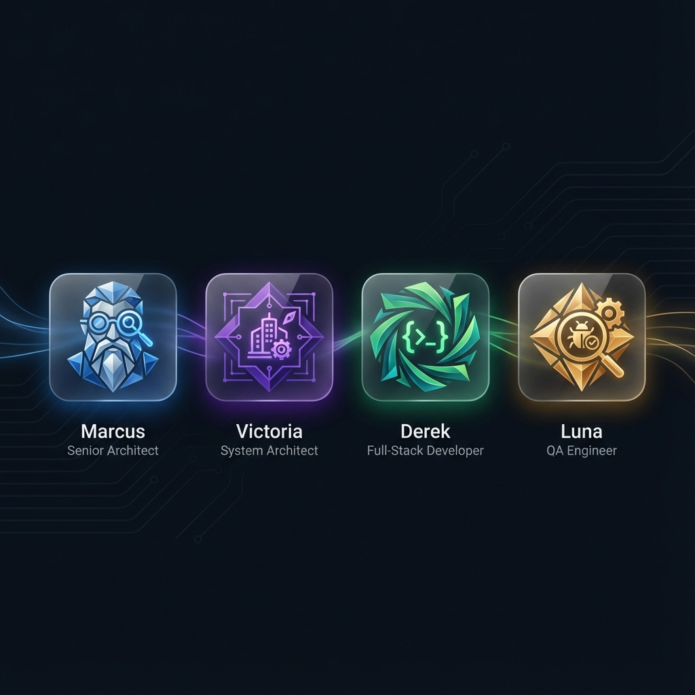

<div align="center">


<br />
<br />

# ⚙️ GenCode Studio Backend

### **The AI Engine That Powers Code Generation**

<br />

[](https://python.org)
[](https://fastapi.tiangolo.com)
[](https://mongodb.com)
[](https://docker.com)

<br />

The **Backend** is where the magic happens — a sophisticated orchestration system that coordinates AI agents, manages workflows, and produces production-ready code.

<br />

> *Receives a prompt → Orchestrates 12 intelligent steps → Delivers tested, deployable code*

<br />

[⚡ Pipeline](#-the-fast-v2-pipeline) • [🌳 ArborMind](#-arbormind-intelligence) • [🤖 Agents](#-ai-agents) • [🩹 Self-Healing](#-self-healing-system) • [🚀 Quick Start](#-quick-start)

<br />

---

</div>

<br />

## ✨ Core Capabilities

<div align="center">

### ⚡ FAST V2 Orchestrator
The intelligent workflow engine: **12 atomic steps** with dependency barriers · **Budget tracking** per step · **Checkpointing** for resume · **Cross-step context** sharing

### 🌳 ArborMind Intelligence
Self-evolving AI routing: **V≠K attention** architecture · **Semantic decision** making · **Pattern learning** from outcomes · **Adaptive strategies**

### 🩹 Self-Healing Pipeline
Automatic error recovery: **Semantic error** classification · **Targeted repair** strategies · **Fallback templates** for edge cases · **Rollback** on critical failures

### 🐳 Docker Sandbox
Isolated testing environment: **Containerized** pytest runs · **Playwright E2E** testing · **MongoDB** test instances · **Full isolation** per project

</div>

<br />

---

<br />

## ⚡ The FAST V2 Pipeline

<div align="center">


<br />
<sub><i>12-step intelligent pipeline with dependency barriers, budget management, and self-healing</i></sub>

</div>

<br />

The FAST V2 Orchestrator executes a carefully designed sequence of steps:

### 🔍 Phase 1 — Analysis
> **Marcus** → `analysis` · Extract entities, classify archetype  
> **Victoria** → `architecture` · Design system, create schemas

### 🎨 Phase 2 — Frontend  
> **Derek** → `frontend_mock` · Generate React UI with mock data  
> **Marcus** → `screenshot_verify` · Visual QA review  
> **Marcus** → `contracts` · Define OpenAPI specifications

### ⚙️ Phase 3 — Backend
> **Derek** → `backend_models` · Generate Beanie/MongoDB models  
> **Derek** → `backend_impl` · Create FastAPI routers  
> **Script** → `system_integration` · Wire main.py & requirements

### 🧪 Phase 4 — Testing & Deploy
> **Derek** → `testing_backend` · Run pytest in Docker  
> **Derek** → `frontend_integration` · Connect UI to real APIs  
> **Luna** → `testing_frontend` · Playwright E2E tests  
> **Marcus** → `preview_final` · Final review & deployment

<br />

---

<br />

## 🌳 ArborMind Intelligence

<div align="center">


<br />
<sub><i>Neural orchestration engine with attention-based routing and self-evolution</i></sub>

</div>

<br />

**ArborMind** powers intelligent decision-making throughout the pipeline:

<table>
<tr>
<td width="33%" align="center">

### 🧠 Attention Router
**V≠K Architecture**

```python
# Query: User request
# Key: Option descriptions  
# Value: Behavior configs

result = await arbormind_route(
    "Fix React bug",
    tool_options
)
# → Smart tool selection
```

</td>
<td width="33%" align="center">

### 🧬 Evolution Engine
**Continuous Learning**

```python
# Learns from every outcome
EVOLUTION = {
    "ema_alpha": 0.3,
    "prompt_mutation": True,
    "step_reordering": True,
}
```

</td>
<td width="33%" align="center">

### 🔮 Pattern Explorer
**Creative Solutions**

```python
# Foreign pattern injection
explorer.inject_patterns(
    context,
    creativity=0.3
)
# → Novel approaches
```

</td>
</tr>
</table>

<br />

**Core Files:**

| File | Lines | Purpose |
|:-----|------:|:--------|
| `router.py` | 36,831 | V≠K attention-based routing |
| `evolution.py` | 21,059 | Self-evolving V-vectors |
| `explorer.py` | 7,818 | Foreign pattern injection |
| `metrics_collector.py` | 13,993 | Pipeline performance tracking |

<br />

---

<br />

## 🤖 AI Agents

<div align="center">



</div>

<br />

| Agent | Role | Responsibility | Steps |
|:-----:|:-----|:---------------|:------|
| 🔵 **Marcus** | Senior Architect | Code review, quality gates, supervision | Analysis, Contracts, Screenshot, Preview |
| 🟣 **Victoria** | System Architect | Designs architecture, data models, API contracts | Architecture |
| 🟢 **Derek** | Full-Stack Dev | Implements React frontends, FastAPI backends | Frontend, Backend, Testing Backend |
| 🟡 **Luna** | QA Engineer | Writes Playwright E2E tests, validates flows | Testing Frontend |

<br />

---

<br />

## 🩹 Self-Healing System

<div align="center">


<br />
<sub><i>Automatic error detection, classification, and targeted repair</i></sub>

</div>

<br />

When steps fail, the system automatically attempts recovery:

<table>
<tr>
<td width="50%">

### Error Classification

| Type | Example | Strategy |
|:-----|:--------|:---------|
| **Syntax** | `SyntaxError: invalid syntax` | AST-guided fix |
| **Import** | `ModuleNotFoundError` | Dependency injection |
| **Logic** | `AttributeError: 'NoneType'` | Context repair |
| **Type** | `TypeError: expected str` | Type coercion |

</td>
<td width="50%">

### Healing Pipeline

```
Error Detected
     ↓
Error Router (classify)
     ↓
Strategy Selection
     ↓
┌────┴────┐
│ LLM Fix │ Fallback │
└────┬────┘
     ↓
Validation
     ↓
✅ Continue or ❌ Escalate
```

</td>
</tr>
</table>

<br />

**Core Files:**

| File | Purpose |
|:-----|:--------|
| `healing_pipeline.py` | Main healing orchestration |
| `error_router.py` | Semantic error classification |
| `self_healing_manager.py` | 48KB of repair logic |
| `fallback_*_agent.py` | Template-based fallback generators |

<br />

---

<br />

## 🏗️ Architecture Overview

```
┌─────────────────────────────────────────────────────────────────────┐
│                         FastAPI Application                          │
├─────────────────────────────────────────────────────────────────────┤
│                                                                       │
│   ┌─────────────┐   ┌─────────────┐   ┌─────────────┐               │
│   │   REST API  │   │  WebSocket  │   │   Health    │               │
│   │  /api/*     │   │  /ws/{id}   │   │   /health   │               │
│   └──────┬──────┘   └──────┬──────┘   └─────────────┘               │
│          │                 │                                          │
│          ▼                 ▼                                          │
│   ┌─────────────────────────────────────────────────────────────┐   │
│   │                   FAST V2 ORCHESTRATOR                       │   │
│   │   • 12 Steps  • Dependencies  • Budget  • Checkpoints       │   │
│   └─────────────────────────────────────────────────────────────┘   │
│                              │                                        │
│          ┌───────────────────┼───────────────────┐                   │
│          ▼                   ▼                   ▼                   │
│   ┌─────────────┐     ┌─────────────┐     ┌─────────────┐           │
│   │  ArborMind  │     │   Agents    │     │ Supervision │           │
│   │  Intelligence│     │ Marcus/Derek│     │   Quality   │           │
│   └─────────────┘     └─────────────┘     └─────────────┘           │
│          │                   │                   │                   │
│          └───────────────────┴───────────────────┘                   │
│                              │                                        │
│                              ▼                                        │
│   ┌─────────────────────────────────────────────────────────────┐   │
│   │                      LLM PROVIDERS                           │   │
│   │        Gemini (default)  │  OpenAI  │  Anthropic            │   │
│   └─────────────────────────────────────────────────────────────┘   │
│                              │                                        │
│          ┌───────────────────┴───────────────────┐                   │
│          ▼                                       ▼                   │
│   ┌─────────────┐                         ┌─────────────┐           │
│   │ Validation  │                         │ Persistence │           │
│   │ AST + Safety│                         │ File Writer │           │
│   └─────────────┘                         └─────────────┘           │
│          │                                       │                   │
│          └───────────────────┬───────────────────┘                   │
│                              ▼                                        │
│   ┌─────────────────────────────────────────────────────────────┐   │
│   │                  DOCKER SANDBOX                              │   │
│   │      Backend Tests  │  Frontend Tests  │  Preview           │   │
│   └─────────────────────────────────────────────────────────────┘   │
│                                                                       │
└─────────────────────────────────────────────────────────────────────┘
```

<br />

---

<br />

## 📁 Directory Structure

```
Backend/
├── app/
│   ├── main.py                  # FastAPI entry point
│   │
│   ├── 📡 api/                  # REST Endpoints (9 files)
│   │   ├── workspace.py         # Generation API
│   │   ├── projects.py          # Project CRUD
│   │   └── sandbox.py           # Docker management
│   │
│   ├── ⚡ orchestration/        # FAST V2 Core (31 files)
│   │   ├── fast_orchestrator.py # Main orchestrator
│   │   ├── healing_pipeline.py  # Self-healing
│   │   ├── budget_manager.py    # Cost tracking
│   │   └── checkpoint.py        # Progress saving
│   │
│   ├── 📋 handlers/             # Step Handlers (20 files)
│   │   ├── analysis.py          # Entity extraction
│   │   ├── architecture.py      # System design
│   │   ├── backend.py           # Router generation
│   │   └── testing_*.py         # Test execution
│   │
│   ├── 🌳 arbormind/            # Intelligence (7 files)
│   │   ├── router.py            # Attention routing
│   │   ├── evolution.py         # Self-evolution
│   │   └── explorer.py          # Pattern discovery
│   │
│   ├── 🤖 agents/               # Agent wrappers
│   ├── 🧠 llm/                  # LLM integration (13 files)
│   ├── 🛡️ supervision/          # Quality gates (4 files)
│   ├── ✅ validation/           # Pre-write checks
│   ├── 💾 persistence/          # File writing
│   ├── 🐳 sandbox/              # Docker (7 files)
│   ├── 📊 tracking/             # Telemetry
│   ├── 📚 learning/             # Pattern store
│   └── 🔧 tools/                # Agent tools
│
├── templates/                    # Project templates (85 files)
├── tests/                        # Unit tests
└── requirements.txt              # Dependencies
```

<br />

---

<br />

## 🌐 API Reference

### Generation

```http
POST /api/workspace/{project_id}/generate
Content-Type: application/json

{
  "prompt": "Create a task management app with projects and deadlines"
}
```

### WebSocket Events

```javascript
const ws = new WebSocket(`ws://localhost:8000/ws/${projectId}`);

ws.onmessage = (event) => {
  const { type, step, agent, message } = JSON.parse(event.data);
  // Types: STEP_START, AGENT_LOG, STEP_COMPLETE, ERROR, WORKFLOW_COMPLETE
};
```

### Endpoints

| Method | Endpoint | Description |
|:-------|:---------|:------------|
| `POST` | `/api/workspace/{id}/generate` | Start generation |
| `GET` | `/api/workspace/{id}` | Workspace details |
| `GET` | `/api/workspace/{id}/files` | List files |
| `POST` | `/api/sandbox/{id}/start` | Start preview |
| `GET` | `/api/projects` | List projects |

<br />

---

<br />

## 🚀 Quick Start

### Prerequisites

| Requirement | Version |
|:------------|:--------|
| **Python** | 3.11+ |
| **Docker** | Latest |
| **MongoDB** | 6.0+ |

### Installation

```bash
# Navigate to backend
cd Backend

# Create virtual environment
python -m venv .venv
.venv\Scripts\activate          # Windows
source .venv/bin/activate       # Linux/Mac

# Install dependencies
pip install -r requirements.txt

# Configure
cp .env.example .env
# Add your GEMINI_API_KEY

# Run
uvicorn app.main:app --reload --port 8000
```

### Environment

```env
# Required
GEMINI_API_KEY=your_key_here
MONGO_URL=mongodb://localhost:27017/gencode

# Optional
LLM_PROVIDER=gemini
LLM_MODEL=gemini-2.0-flash-exp
LOG_LEVEL=INFO
```

### Access

| URL | Description |
|:----|:------------|
| `http://localhost:8000` | API |
| `http://localhost:8000/docs` | Swagger UI |
| `http://localhost:8000/redoc` | ReDoc |

<br />

---

<br />

<div align="center">

### Part of [GenCode Studio](../README.md)

**⚡ Powered by FastAPI • MongoDB • Google Gemini**

<br />

<sub>The brain behind intelligent code generation</sub>

</div>
