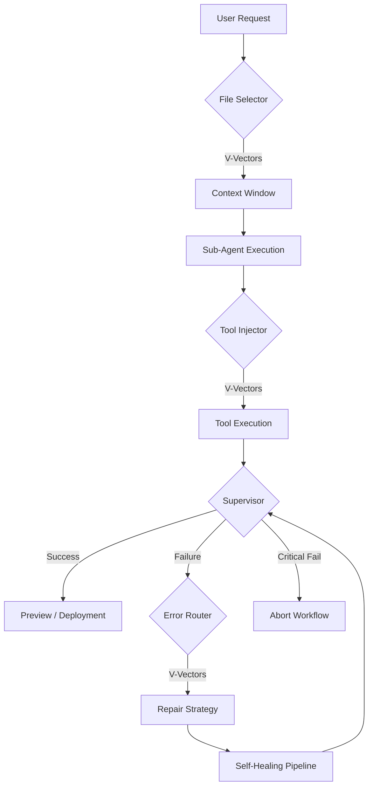
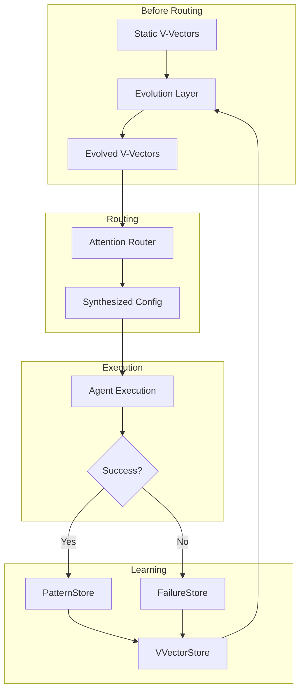

# Universal Attention System (V≠K Architecture)

**Author:** GenCode AI Team  
**System:** FAST v2 Orchestrator  
**Status:** Production (Active)

---

## 1. Core Philosophy: "Attention is Control"

Traditional agents use rule-based logic (if/else) or simple semantic search (ranking).
**GenCode FAST v2** introduces the **Universal Attention Router** which treats Attention not just as a selection mechanism, but as a **Parameter Synthesis Engine**.

### The Mathematical Shift: V ≠ K

Standard RAG systems use scaled dot-product attention:
$$ \text{Attention}(Q, K, V) = \text{softmax}\left(\frac{QK^T}{\sqrt{d_k}}\right)V $$
Where $V = K$ (The value returned is the embedding or ID of the match).

**Our System uses $V \neq K$ with Custom Scaling:**
*   **Q (Query):** The user request or error log (Unit Vector).
*   **K (Key):** The semantic description of the option (Unit Vector).
*   **V (Value):** An arbitrary behavior configuration object (JSON).

**Refined Formula:**
Since we use unit-normalized embeddings (OpenAI/Gemini), the standard $\sqrt{d_k}$ scaling results in overly "soft" distributions. We use a **sharpness factor ($\sigma = 20.0$)** to ensure high-confidence routing:

$$ \text{Attention}(Q, K, V) = \text{softmax}\left((Q \cdot K^T) \times 20.0 \right)V $$

**Result:** The system synthesizes a **weighted configuration** that blends behaviors when ambiguous, but commits decisively when clear.

---

## 2. The Logic Flow: From Request to Preview

The Attention System intercepts every major decision point in the FAST v2 workflow.



### Key Intercepts:
1.  **Start (`sub_agents.py`):** Attention determines **file context mode** (Narrow vs Broad).
2.  **During (`registry.py`):** Attention selects and configures **tools** (Strict vs Creative).
3.  **Failure (`error_router.py`):** Attention determines **repair strategies** (Dependencies vs Logic).
4.  **Loop (`supervisor.py`):** Attention determines **supervision policy** (Retry vs Abort).

---

## 3. Old System vs. New System (Comparison)

| Feature | ❌ Old System (FAST v1) | ✅ New System (FAST v2 + Attention) |
| :--- | :--- | :--- |
| **Error Handling** | **Regex Matching:** Brittle. If error didn't match `r"SyntaxError"`, it failed or defaulted blindly. | **Semantic Routing:** Understands "It looks like a syntax error but might be configuration". <br> **Output:** Synthesized repair parameters (e.g., `max_edits=2.4`). |
| **File Context** | **Hardcoded Limit:** Always `files[:5]`. Irrelevant files cluttered context. Large projects failed. | **Adaptive Context:** <br> - Typo fix? → `max_files=4` (Narrow) <br> - Refactor? → `max_files=15` (Broad) <br> **Result:** cheaper, smarter agents. |
| **Tools** | **Static List:** All tools available all the time. Confused the LLM. | **Dynamic Injection:** Only relevant tools injected from **30+ available**. <br> **Configured:** Tools receive mode params (e.g., `mode="strict"` for diffs). |
| **Supervision** | **Simple Counter:** `if retries < 3: retry`. Dumb looping. | **Attention-Policy:** Synthesized decision. <br> - "This error is hopeless" → **Abort immediately**. <br> - "Just a nit" → **Retry**. |
| **Architecture** | **Rule-Based:** Millions of `if/else` statements. | **Attention-Based:** Mathematical vector space decisions. |

---

## 4. System Architecture: The V!=K Ecosystem

The system operates via a tightly integrated loop involving **4 Core Files** and **2 Compliance Officers**.

### A. The Core Action Loop (How work gets done)

1.  **The Catalog:** `app/tools/registry.py`
    *   **Role:** Defines the "Product Catalog" (30+ Tools).
    *   **V!=K:** Stores the semantic descriptions ($K$) and default behavior parameters ($V$).
    *   **Status:** Powered by dynamic definitions for Execution, Database, Testing, and DevOps.

2.  **The Engine:** `app/attention/router.py`
    *   **Role:** The Intelligence ($V \neq K$ Logic).
    *   **Action:** Receives a query + options. Synthesizes a **Weighted Configuration**.
    *   **Implementation:** Centralized routing logic decoupling math from business rules.

3.  **The Manager:** `app/agents/sub_agents.py`
    *   **Role:** The Runtime Orchestrator.
    *   **Action:** Pauses execution to query the Engine. *"I need to fix a bug. Which tools do I need?"*
    *   **Result:** Dynamically receives a subset of tools configured for "Strict Mode".

4.  **The Translator:** `app/llm/prompt_management.py`
    *   **Role:** The Prompt Engineer.
    *   **Action:** Injects the router's synthesized configuration into the System Prompt.
    *   **Output:** The LLM sees:
        ```text
        === Tools Available ===
        - dbqueryrunner:
             mode: strict
             read_only: False
             description: Run specific queries against the database.
        ```

### B. The Compliance Officers (Quality & Repair)

5.  **The Reviewer:** `app/supervision/supervisor.py`
    *   **Role:** Enforces Quality Policy.
    *   **Action:** Uses Attention to decide *how* to handle a specific quality score.
    *   **Outcome:** Synthesizes a policy (e.g., `"retry_count": 2, "force_healer": False`).

6.  **The Specialist:** `app/orchestration/error_router.py`
    *   **Role:** Diagnoses Crashes.
    *   **Action:** Maps raw exception logs to specific repair strategies.
    *   **Outcome:** Configures the Self-Healing Pipeline with precise parameters.

---

## 5. How to Use

Import from the centralized router module to make smart decisions anywhere in the backend.

```python
from app.attention import route_query

options = [
    {
        "id": "fast_mode",
        "description": "User wants speed",
        "value": {"timeout": 10, "depth": 1}
    },
    {
        "id": "deep_mode",
        "description": "User wants quality",
        "value": {"timeout": 60, "depth": 5}
    }
]

# The router will BLEND these values based on the query!
result = await route_query("I need this done somewhat quickly but keep quality high", options)

print(result["value"])
# Output: {'timeout': 35.0, 'depth': 3.0} (Interpolated!)
```

---

## 6. Self-Evolving Architecture (NEW)

The Attention System now integrates with a **Self-Evolving Architecture** that learns from routing outcomes.

### The Feedback Loop



### Key Components

1.  **VVectorStore** (`app/learning/v_vector_store.py`)
    *   Records every routing decision with its synthesized V-vector
    *   Links outcomes (success/failure/partial) to decisions
    *   Computes evolved V-vectors using Exponential Moving Average (EMA)

2.  **AttentionEvolution** (`app/attention/evolution.py`)
    *   Bridge between VVectorStore and the Router
    *   Applies evolution before routing decisions
    *   Cross-references PatternStore and FailureStore for comprehensive learning

3.  **Integrated Router** (`app/attention/router.py`)
    *   Automatically evolves options before routing
    *   Tracks decisions with `decision_id` for outcome linking
    *   Returns `evolved` flag indicating if learning was applied

### How It Works

```python
from app.attention import route_query, report_routing_outcome

# 1. Make a routing decision (evolution applied automatically)
result = await route_query(
    "Fix a React component bug",
    tool_options,
    context_type="tool_selection",
    archetype="admin_dashboard"
)

# The router returns evolved V-vectors if available
print(result["value"])  # Possibly evolved from historical learning
print(result["evolved"])  # True if evolution was applied
decision_id = result["decision_id"]  # For outcome tracking

# 2. Execute the task with the synthesized config
# ...

# 3. Report the outcome (this drives learning)
report_routing_outcome(
    decision_id=decision_id,
    success=True,
    quality_score=8.5,
    details="Task completed successfully"
)
```

### Learning Databases

| File | Database | Purpose |
|:-----|:---------|:--------|
| `v_vector_store.py` | `v_vector_history.db` | Routing decisions & evolved V-vectors |
| `pattern_store.py` | `pattern_memory.db` | Successful code patterns |
| `failure_store.py` | `failure_memory.db` | Anti-patterns to avoid |

---

## 7. Self-Evolving Subsystems

The following subsystems now participate in the self-evolution loop:

### A. 🎯 Supervisor Policies (supervisor.py)
**What evolves:** Retry thresholds, abort decisions, healer delegation
```python
# Before: Static rules
if quality < 5: retry()

# After: Learned policies
result = await route_query(issue_query, SUPERVISOR_POLICIES, context_type="supervisor_policy")
# Returns: {"retry_count": 1.8, "force_healer": False, "abort_threshold": 0.15}
```

### B. 🔧 Error Handling (error_router.py)
**What evolves:** Repair strategy selection, fix aggressiveness
```python
# Before: Regex matching
if "SyntaxError" in error: return "syntax_fix"

# After: Semantic + learned routing
result = await decide_repair_strategy(error_log, archetype="admin_dashboard")
# Returns: {"selected": "dependency_fix", "max_edits": 1.5, "apply_diff": True}
```

### C. 📁 File Selection (prompt_management.py)
**What evolves:** Context width, summary usage, test inclusion
```python
# Before: Fixed limit
files = all_files[:5]

# After: Adaptive context
result = await get_adaptive_file_context(task, step, archetype, all_files)
# Returns: {"files": [...], "mode": "focused", "max_files": 8, "use_summaries": True}
```

### D. 🩹 Healing Pipeline (healing_pipeline.py)
**What evolves:** Strategy parameters, verification thresholds
```python
# Before: Generic repair
healer.repair(artifact)

# After: Learned strategies
result = await attempt_heal(step, error_log, archetype="crud_api")
# Uses evolved parameters for max_edits, apply_diff, retry_on_fail
```

### E. 🛠️ Tool Selection (registry.py + router.py)
**What evolves:** Tool priorities, mode selection, temperature
```python
# Before: All tools available
tools = TOOL_DEFINITIONS

# After: Evolved selection
result = await route_query(task, evolved_tool_options, context_type="tool_selection")
# Returns tools with adjusted: mode, temperature, strictness, priority
```

---

## 8. Future Roadmap

| Status | Feature | Description |
|:-------|:--------|:------------|
| ✅ | **RLHF Feedback Loop** | V-vector evolution from outcomes |
| ✅ | **Supervisor Learning** | Adaptive retry/abort policies |
| ✅ | **Error Strategy Learning** | Repair strategies improve over time |
| ✅ | **File Context Learning** | Context width adapts to task type |
| 🔄 | **Planner Integration** | Planner Agent tunes Worker weights |
| 📅 | **Multi-Modal Attention** | Image embeddings for UI components |
| 📅 | **Cross-Project Learning** | Share evolved vectors across archetypes |
| 📅 | **Active Learning** | Request feedback on uncertain decisions |


