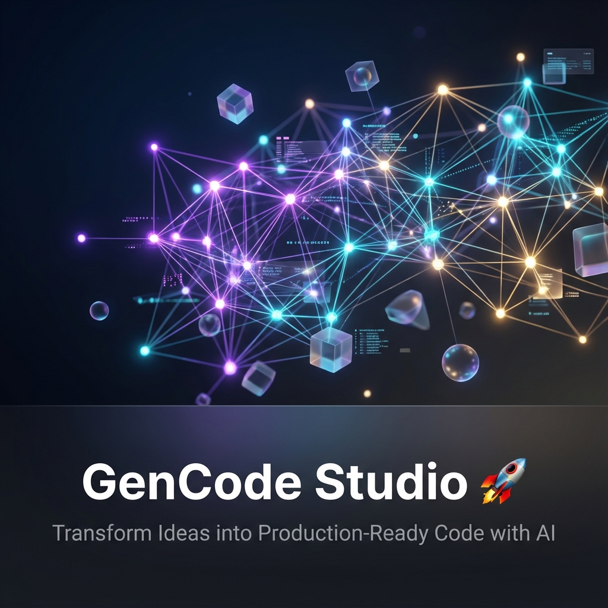
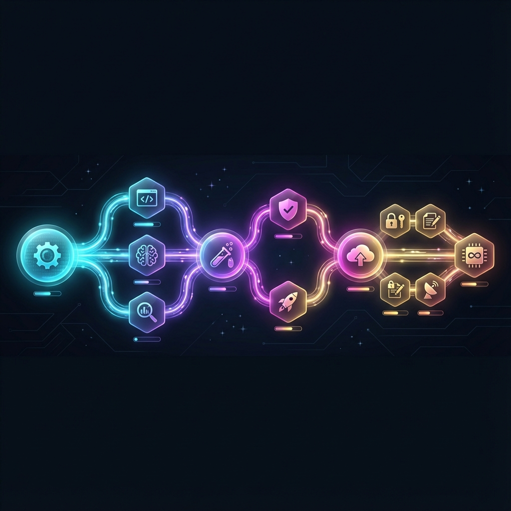

<div align="center">



<br />

[](https://python.org)
[](https://fastapi.tiangolo.com)
[](https://reactjs.org)
[](https://mongodb.com)
[](https://deepmind.google/technologies/gemini/)

<br />

**GenCode Studio** is an AI-powered code generation platform that transforms natural language descriptions into complete, tested, production-ready full-stack applications.

<br />

> *"Build me a bug tracking system with projects, issues, and user assignments"*
> 
> → **Complete FastAPI backend + React frontend in minutes, not days.**

<br />

[✨ Features](#-key-features) • [🤖 AI Agents](#-meet-the-ai-team) • [🌳 ArborMind](#-arbormind--neural-orchestration) • [🚀 Quick Start](#-quick-start) • [📖 Docs](#-api-reference)

<br />

---

</div>

<br />

## ✨ Key Features

### 🤖 Multi-Agent Intelligence
A specialized team of AI agents work together: **Code Review & Quality Gates** · **Architecture Design & Planning** · **Full-Stack Implementation** · **Automated E2E Testing**

### 🌳 Self-Evolving AI  
ArborMind orchestration engine: **Learns from every generation** · **Adapts strategies in real-time** · **Attention-based smart routing** · **Evidence-based reliability**

### 🛡️ Production-Grade Output
Enterprise-quality code generation: **AST validation before write** · **Pre-flight syntax checks** · **Docker sandbox testing** · **Automatic rollback on failure**

### 🎨 Intelligent UI Design
Smart frontend generation: **6 UI vibes** (Dark, Minimal, Glass...) · **Archetype detection** (SaaS, E-commerce...) · **Modern shadcn/ui components** · **Mobile-first responsive design**

<br />

---

<br />

## 🤖 Meet the AI Team

<div align="center">


</div>

<br />

<table>
<tr>
<td align="center" width="25%">

### 🔵 Marcus
**Senior Architect**

*The Supervisor*

Code review, quality gates, final approval. Ensures every line meets production standards.

</td>
<td align="center" width="25%">

### 🟣 Victoria
**System Architect**

*The Strategist*

Designs system architecture, API contracts, and database schemas from requirements.

</td>
<td align="center" width="25%">

### 🟢 Derek
**Full-Stack Developer**

*The Builder*

Implements React frontends, FastAPI backends, and integrates everything seamlessly.

</td>
<td align="center" width="25%">

### 🟡 Luna
**QA Engineer**

*The Guardian*

Writes and runs Playwright E2E tests, catches bugs before deployment.

</td>
</tr>
</table>

<br />

---

<br />

## ⚡ The FAST V2 Pipeline

<div align="center">



<br />
<sub><i>4-Phase Linear Pipeline — One-Shot execution with strict separation of Causal and Evidence steps</i></sub>

</div>

<br />

| Phase | Steps | What Happens |
|:------|:------|:-------------|
| **🔍 Analysis** | 1-2 | Understand requirements, extract entities, design architecture |
| **🎨 Frontend** | 3 | Generate React UI with mock data for immediate visual feedback |
| **⚙️ Backend** | 4-7 | Create models, API contracts, FastAPI routers, database integration |
| **🔗 Integration** | 8-9 | Connect frontend to real APIs, visual QA verification |
| **🧪 Testing** | 10-11 | Run pytest backend tests, Playwright E2E tests in Docker |
| **🚀 Deploy** | 12 | Final review, generate preview URL, ready for production |

<br />

---

<br />

## 🌳 ArborMind — Neural Orchestration

<div align="center">


<br />
<sub><i>ArborMind One-Shot Pipeline — Linear causal chain with evidence-based observation branches</i></sub>

</div>

<br />

**ArborMind (AM)** is our next-generation orchestration engine featuring:

### 🧠 Attention Router — V≠K Architecture
Unlike traditional RAG where V=K, ArborMind uses separate Key and Value vectors for semantic routing that synthesizes weighted configurations.

```python
# Smart routing example
result = await arbormind_route("Fix React component bug", tool_options)
# → {mode: "strict", max_edits: 2}
```

### ⚡ Hybrid Workflow — Flexible Execution
Intelligently combines sequential and parallel execution. Steps run in parallel when independent, sequentially when dependent.

### 🧬 Self Evolution — Continuous Learning
Learns from every success and failure using EMA-adjusted V-vectors. Gets smarter with every generation.

```python
EVOLUTION = {"prompt_mutation": True, "step_reordering": True, "ema_alpha": 0.3}
```

<br />

---

<br />

## 🚀 Quick Start

### Prerequisites

| Requirement | Version | Why |
|:------------|:--------|:----|
| **Python** | 3.11+ | Backend runtime |
| **Node.js** | 18+ | Frontend build |
| **Docker** | Latest | Sandbox testing |
| **MongoDB** | 6.0+ | Database |

### Installation

```bash
# Clone the repository
git clone https://github.com/NeuralNinja23/GenCode-Studio.git
cd GenCode-Studio

# Backend setup
cd Backend
python -m venv .venv
.venv\Scripts\activate          # Windows
# source .venv/bin/activate     # Linux/Mac
pip install -r requirements.txt

# Configure environment
cp .env.example .env
# Edit .env with your GEMINI_API_KEY

# Start backend
uvicorn app.main:app --reload --port 8000

# Frontend setup (new terminal)
cd Frontend
npm install
npm run dev
```

### Environment Variables

```env
# 🔑 Required
GEMINI_API_KEY=your_gemini_api_key_here
MONGO_URL=mongodb://localhost:27017/gencode_studio

# ⚙️ Optional
LLM_PROVIDER=gemini
LLM_MODEL=gemini-2.0-flash-exp
WORKSPACE_ROOT=./workspaces
LOG_LEVEL=INFO

# 🐳 Docker
DOCKER_HOST=npipe:////./pipe/docker_engine    # Windows
# DOCKER_HOST=unix:///var/run/docker.sock     # Linux/Mac
```

<br />

---

<br />

## 🏗️ Architecture

```
GenCode-Studio/
├── 📁 Backend/
│   ├── 📁 app/
│   │   ├── 📁 agents/            # Marcus, Derek, Victoria, Luna
│   │   ├── 📁 arbormind/         # 🌳 Neural orchestration core
│   │   │   ├── router.py         # Attention-based routing
│   │   │   ├── evolution.py      # Self-evolving V-vectors
│   │   │   └── explorer.py       # Pattern exploration
│   │   ├── 📁 orchestration/     # FAST V2 engine
│   │   ├── 📁 persistence/       # File validation & writing
│   │   ├── 📁 sandbox/           # Docker container management
│   │   ├── 📁 tools/             # 30+ injectable tools
│   │   └── main.py               # FastAPI entry point
│   └── 📁 templates/             # shadcn/ui, boilerplate
│
├── 📁 Frontend/
│   └── 📁 src/                   # React application
│
└── 📁 workspaces/                # Generated projects
```

<br />

---

<br />

## 📖 API Reference

### Generate Application

```http
POST /api/workspace/{project_id}/generate
Content-Type: application/json

{
  "prompt": "Create a task management app with projects, tasks, and team collaboration"
}
```

### WebSocket Events

```javascript
const ws = new WebSocket(`ws://localhost:8000/ws/${workflowId}`);

ws.onmessage = (event) => {
  const { type, step, agent, message } = JSON.parse(event.data);
  
  // Types: STEP_START, AGENT_LOG, STEP_COMPLETE, WORKFLOW_COMPLETE, ERROR
};
```

### Endpoints

| Method | Endpoint | Description |
|:-------|:---------|:------------|
| `GET` | `/api/workspace/{id}` | Get workspace details |
| `GET` | `/api/workspace/{id}/files` | List generated files |
| `POST` | `/api/workspace/{id}/preview` | Start preview server |
| `DELETE` | `/api/workspace/{id}` | Delete workspace |

<br />

---

<br />

## 🛡️ Reliability & Quality

<table>
<tr>
<td width="50%">

### Pre-flight Validation
- ✅ AST syntax parsing for all Python files
- ✅ Empty content detection
- ✅ Bracket balance checking
- ✅ Truncation detection
- ✅ Undefined name checking

</td>
<td width="50%">

### Evidence-Based Reliability
- 🛡️ Strict Environment vs Cognitive separation
- ⛔ One-Shot Policy for causal logic (no loops)
- ↩️ Selective retries for infrastructure only
- 🏥 Automatic environment recovery
- 🔒 Cognitive failure quarantine

</td>
</tr>
</table>

<br />

---

<br />

## 🎨 UI Archetypes & Vibes

GenCode Studio intelligently detects your app type and applies matching aesthetics:

**Archetypes:** `admin_dashboard` • `ecommerce_store` • `saas_app` • `realtime_collab` • `portfolio_site` • `developer_tools`

**Vibes:** `dark_hacker` • `minimal_light` • `vibrant_modern` • `playful_colorful` • `corporate_clean` • `glassmorphism`

<br />

---

<br />

## 🤝 Contributing

We welcome contributions! See our [Contributing Guide](CONTRIBUTING.md) for details.

```bash
# Fork, clone, then:
git checkout -b feature/amazing-feature
git commit -m 'feat: add amazing feature'
git push origin feature/amazing-feature
# Open a Pull Request
```

<br />

---

<br />

## 📄 License

MIT License — see [LICENSE](LICENSE) for details.

<br />

---

<div align="center">

<br />

### Built with ❤️ by [NeuralNinja23](https://github.com/NeuralNinja23)

<br />

**⭐ Star this repo if GenCode Studio helps you build faster!**

<br />

<sub>GenCode Studio — From idea to production in minutes, not months.</sub>

<br />
<br />

</div>
