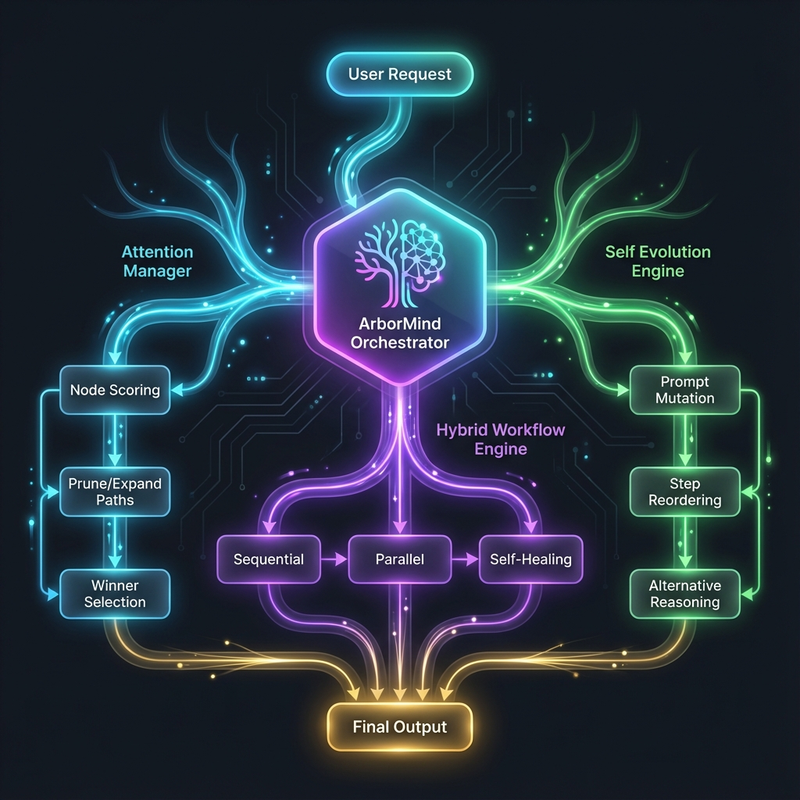
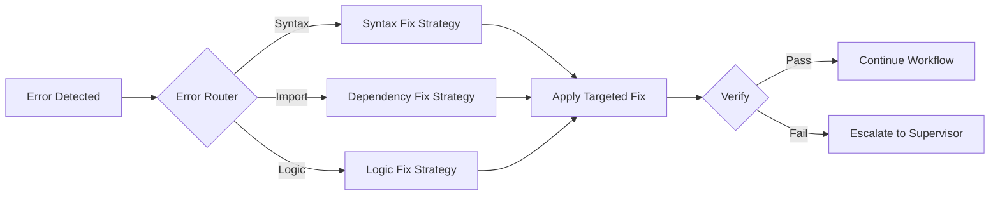

<div align="center">


# 🚀 GenCode Studio

### **AI-Powered Full-Stack Code Generation with Multi-Agent Orchestration**

[](https://python.org)
[](https://fastapi.tiangolo.com)
[](https://reactjs.org)
[](https://mongodb.com)
[](https://docker.com)
[](https://deepmind.google/technologies/gemini/)

---

**Transform natural language descriptions into production-ready full-stack applications**

> *"Write a bug tracking system with projects, issues, and user assignments"*  
> → GenCode Studio generates a complete FastAPI backend + React frontend, tested and ready to deploy.

[✨ Features](#-features) • [🧠 How It Works](#-how-it-works) • [🚀 Quick Start](#-quick-start) • [🏗️ Architecture](#️-architecture) • [📖 API Reference](#-api-reference)

</div>

---

## ✨ Features

<table>
<tr>
<td width="50%" valign="top">

### 🤖 Multi-Agent System
A team of specialized AI agents, each with distinct expertise:

| Agent | Role | Specialty |
|:------|:-----|:----------|
| **Marcus** | Senior Architect | Code review, quality gates, supervision |
| **Victoria** | System Architect | Architecture design, planning, contracts |
| **Derek** | Full-Stack Dev | Frontend + Backend implementation |
| **Luna** | QA Engineer | Playwright E2E testing, DevOps |

</td>
<td width="50%" valign="top">

### 🌳 ArborMind (AM)
Next-generation orchestration with **self-evolving intelligence**:

- **Hybrid Workflow Engine** — Sequential + parallel step execution
- **Attention-Based Routing** — Semantic decision making (V≠K architecture)
- **Self-Evolution** — Learns from outcomes via EMA-adjusted V-vectors
- **Combinational Mode** — Soft-blends agent capabilities for complex tasks

</td>
</tr>
<tr>
<td width="50%" valign="top">

### 🛡️ Production-Grade Reliability
- **AST-based syntax validation** before any file is written
- **Pre-flight checks** — Empty content, truncation, bracket balance
- **Quality gates** — Minimum score thresholds block bad code
- **Automatic rollback** on critical failures
- **Docker sandbox** for isolated testing

</td>
<td width="50%" valign="top">

### 🎨 Intelligent UI Generation
- **Archetype detection** — Dashboard, E-commerce, SaaS, Portfolio, etc.
- **6 UI vibes** — Dark Hacker, Minimal Light, Glassmorphism, and more
- **shadcn/ui components** — Modern, accessible component library
- **Responsive by default** — Mobile-first design patterns

</td>
</tr>
<tr>
<td width="50%" valign="top">

### 🔄 FAST V2 Workflow Engine
- **12-step generation pipeline** with dependency awareness
- **Budget management** — ~₹30/run cost tracking
- **Self-healing on failures** — Targeted fixes, not blind retries
- **Real-time WebSocket updates** — Watch agents work live

</td>
<td width="50%" valign="top">

### 🩹 Self-Healing Pipeline
- **Semantic error routing** — Understands *why* failures happen
- **Targeted repair strategies** — Syntax, dependency, logic fixes
- **Differential context** — Only relevant files sent for repair
- **Fallback generation** — Auto-creates missing components

</td>
</tr>
</table>

---

## 🧠 How It Works

### The 12-Step Workflow

GenCode Studio orchestrates a complete software development lifecycle:

```
┌────────────────────────────────────────────────────────────────────────────────┐
│                           FAST V2 WORKFLOW ENGINE                              │
├────────────────────────────────────────────────────────────────────────────────┤
│                                                                                │
│   1️⃣ ANALYSIS        2️⃣ ARCHITECTURE     3️⃣ FRONTEND MOCK    4️⃣ BACKEND MODELS  │
│   ┌─────────┐        ┌─────────┐         ┌─────────┐         ┌─────────┐       │
│   │ Marcus  │   →    │Victoria │    →    │  Derek  │    →    │  Derek  │       │
│   │ Analyze │        │ Design  │         │Mock UI  │         │ Models  │       │
│   └─────────┘        └─────────┘         └─────────┘         └─────────┘       │
│                                                                                │
│   5️⃣ CONTRACTS       6️⃣ BACKEND ROUTES   7️⃣ BACKEND MAIN     8️⃣ INTEGRATION     │
│   ┌─────────┐        ┌─────────┐         ┌─────────┐         ┌─────────┐       │
│   │ Marcus  │   →    │  Derek  │    →    │  Derek  │    →    │  Derek  │       │
│   │Finalize │        │ Routes  │         │  Main   │         │ Connect │       │
│   └─────────┘        └─────────┘         └─────────┘         └─────────┘       │
│                                                                                │
│   9️⃣ SCREENSHOT     🔟 TEST BACKEND      1️⃣1️⃣ TEST FRONTEND   1️⃣2️⃣ PREVIEW       │
│   ┌─────────┐        ┌─────────┐         ┌─────────┐         ┌─────────┐       │
│   │ Marcus  │   →    │  Derek  │    →    │  Luna   │    →    │ Marcus  │       │
│   │ Verify  │        │ Pytest  │         │Playwright│        │ Final   │       │
│   └─────────┘        └─────────┘         └─────────┘         └─────────┘       │
│                                                                                │
└────────────────────────────────────────────────────────────────────────────────┘
```

| Step | Agent | What Happens |
|:-----|:------|:-------------|
| **1. Analysis** | Marcus | Understands requirements, extracts entities & relationships |
| **2. Architecture** | Victoria | Designs system architecture, defines API contracts |
| **3. Frontend Mock** | Derek | Creates React UI with mock data (immediate visual feedback) |
| **4. Backend Models** | Derek | Generates MongoDB/Beanie models from architecture |
| **5. Contracts** | Marcus | Finalizes OpenAPI contracts from mock data patterns |
| **6. Backend Routers** | Derek | Creates FastAPI endpoints matching contracts |
| **7. Backend Main** | Derek | Configures FastAPI app entry point with CORS, routes |
| **8. Frontend Integration** | Derek | Replaces mock data with real API calls |
| **9. Screenshot Verify** | Marcus | Visual QA review of the generated UI |
| **10. Testing Backend** | Derek | Runs pytest in Docker sandbox |
| **11. Testing Frontend** | Luna | Runs Playwright E2E tests |
| **12. Preview Final** | Marcus | Final review, generates preview URL |

---

## 🌳 ArborMind — Neural Orchestration Engine

<div align="center">



<br />
<sub><i>ArborMind's tree-inspired neural architecture enables intelligent, self-evolving code generation</i></sub>

</div>

<br />

**ArborMind (AM)** is GenCode Studio's next-generation orchestration engine that mimics how a tree grows — branching intelligently, pruning ineffective paths, and evolving based on outcomes.

<table>
<tr>
<td width="33%" align="center">

### 🧠 Attention Manager
**Semantic Decision Making**

```
┌─────────────────┐
│  Node Scoring   │
│       ↓         │
│ ┌─────┴─────┐   │
│ │Prune│Expand│  │
│ └─────┬─────┘   │
│       ↓         │
│ Winner Select   │
└─────────────────┘
```

*Routes requests to the optimal agent based on semantic similarity scores*

</td>
<td width="33%" align="center">

### ⚡ Hybrid Workflow
**Flexible Execution**

```
┌─────────────────┐
│   Sequential    │
│       ↓         │
│    Parallel     │
│       ↓         │
│  Combinational  │
│       ↓         │
│  Self-Healing   │
└─────────────────┘
```

*Blends sequential and parallel execution with automatic error recovery*

</td>
<td width="33%" align="center">

### 🧬 Self Evolution
**Continuous Learning**

```
┌─────────────────┐
│ Prompt Mutation │
│       ↓         │
│ Step Reordering │
│       ↓         │
│ Model Selection │
│       ↓         │
│ Alt. Reasoning  │
└─────────────────┘
```

*Learns from successes and failures via EMA-adjusted V-vectors*

</td>
</tr>
</table>

### The V≠K Attention Architecture

Unlike traditional RAG systems where `V = K`, GenCode Studio uses **V ≠ K** architecture:

| Component | Purpose |
|:----------|:--------|
| **Q (Query)** | The user request or error log (unit vector) |
| **K (Key)** | Semantic description of options (unit vector) |
| **V (Value)** | Arbitrary behavior configuration (JSON) |

**Result:** The system synthesizes *weighted configurations* that blend behaviors when ambiguous, but commit decisively when clear.

```python
# Example: ArborMind synthesizes tool configuration
result = await arbormind_route("I need to fix a React component bug", tool_options)
# → Returns: {mode: "strict", max_edits: 2, apply_diff: true}
```

---

## 🚀 Quick Start

### Prerequisites

| Requirement | Version | Purpose |
|:------------|:--------|:--------|
| Python | 3.11+ | Backend runtime |
| Node.js | 18+ | Frontend build |
| Docker Desktop | Latest | Sandbox testing |
| MongoDB | 6.0+ | Database (local or Atlas) |

### Installation

```bash
# 1️⃣ Clone the repository
git clone https://github.com/NeuralNinja23/GenCode-Studio.git
cd GenCode-Studio

# 2️⃣ Backend setup
cd Backend
python -m venv .venv
.venv\Scripts\activate          # Windows
# source .venv/bin/activate     # Linux/Mac
pip install -r requirements.txt

# 3️⃣ Configure environment
cp .env.example .env
# Edit .env with your API keys (see below)

# 4️⃣ Start backend
uvicorn app.main:app --reload --port 8000

# 5️⃣ Frontend setup (new terminal)
cd Frontend
npm install
npm run dev
```

### Environment Variables

Create a `.env` file in the `Backend` directory:

```env
# ═══════════════════════════════════════════════════════════════
# 🔑 REQUIRED
# ═══════════════════════════════════════════════════════════════
GEMINI_API_KEY=your_gemini_api_key_here
MONGO_URL=mongodb://localhost:27017/gencode_studio

# ═══════════════════════════════════════════════════════════════
# ⚙️ OPTIONAL (with defaults)
# ═══════════════════════════════════════════════════════════════
LLM_PROVIDER=gemini                    # gemini | openai | anthropic
LLM_MODEL=gemini-2.0-flash-exp         # Default model
WORKSPACE_ROOT=./workspaces            # Generated project location
LOG_LEVEL=INFO                         # DEBUG | INFO | WARNING | ERROR

# ═══════════════════════════════════════════════════════════════
# 🐳 DOCKER (for sandbox testing)
# ═══════════════════════════════════════════════════════════════
DOCKER_HOST=npipe:////./pipe/docker_engine    # Windows
# DOCKER_HOST=unix:///var/run/docker.sock     # Linux/Mac
```

---

## 🏗️ Architecture

### High-Level Overview

```
┌─────────────────────────────────────────────────────────────────┐
│                        GenCode Studio                           │
├─────────────────────────────────────────────────────────────────┤
│  ┌─────────┐  ┌─────────┐  ┌─────────┐  ┌─────────┐             │
│  │ Marcus  │  │  Derek  │  │Victoria │  │  Luna   │   Agents   │
│  │Supervisor│  │Developer│  │Architect│  │   QA    │             │
│  └────┬────┘  └────┬────┘  └────┬────┘  └────┬────┘             │
│       │            │            │            │                   │
│       └────────────┴────────────┴────────────┘                   │
│                          ▼                                       │
│  ┌───────────────────────────────────────────────────────────┐  │
│  │              Universal Attention Router                    │  │
│  │       (Semantic Routing • V≠K Architecture • 30+ Tools)    │  │
│  └───────────────────────────────────────────────────────────┘  │
│                          ▼                                       │
│  ┌───────────────────────────────────────────────────────────┐  │
│  │                  FAST V2 Orchestrator                      │  │
│  │  ┌─────────┐ ┌─────────┐ ┌─────────┐ ┌─────────┐          │  │
│  │  │Analysis │→│ Arch    │→│Frontend │→│Backend  │→ ...     │  │
│  │  └─────────┘ └─────────┘ └─────────┘ └─────────┘          │  │
│  └───────────────────────────────────────────────────────────┘  │
│                          ▼                                       │
│  ┌───────────────────────────────────────────────────────────┐  │
│  │              Validation & Persistence Layer                │  │
│  │  • AST Syntax Check  • Pre-flight Gates  • Quality Scores │  │
│  └───────────────────────────────────────────────────────────┘  │
│                          ▼                                       │
│  ┌───────────────────────────────────────────────────────────┐  │
│  │                    Docker Sandbox                          │  │
│  │        Backend Tests  │  Frontend Tests  │  Preview        │  │
│  └───────────────────────────────────────────────────────────┘  │
└─────────────────────────────────────────────────────────────────┘
```

### Project Structure

```
GenCode-Studio/
├── 📁 Backend/
│   ├── 📁 app/
│   │   ├── 📁 agents/            # Marcus, Derek, Victoria, Luna
│   │   ├── 📁 api/               # REST API endpoints
│   │   ├── 📁 arbormind/         # 🌳 ArborMind Intelligence Core
│   │   │   ├── router.py         # Attention-based routing (V≠K)
│   │   │   ├── evolution.py      # Self-evolving V-vectors
│   │   │   └── explorer.py       # E-AM foreign pattern injection
│   │   ├── 📁 core/              # Config, constants, logging
│   │   ├── 📁 handlers/          # Workflow step implementations
│   │   ├── 📁 learning/          # Pattern, Failure, V-Vector stores
│   │   ├── 📁 llm/               # LLM adapters (Gemini, OpenAI, Anthropic)
│   │   ├── 📁 models/            # Pydantic/Beanie data models
│   │   ├── 📁 orchestration/     # FAST V2 engine, error routing
│   │   ├── 📁 persistence/       # File validation & writing
│   │   ├── 📁 sandbox/           # Docker container management
│   │   ├── 📁 supervision/       # Quality gates, code review
│   │   ├── 📁 tools/             # 30+ injectable tools
│   │   └── main.py               # FastAPI entry point
│   ├── 📁 templates/             # shadcn/ui components, boilerplate
│   └── 📁 tests/                 # pytest test suite
│
├── 📁 Frontend/
│   ├── 📁 src/
│   │   ├── 📁 components/        # React components
│   │   ├── 📁 pages/             # Route pages
│   │   └── 📁 lib/               # API client, utilities
│   └── package.json
│
└── 📁 workspaces/                # Generated projects (gitignored)
```

---

## 🎨 ArborMind Attention Routing

GenCode Studio classifies requests into **archetypes** and **vibes** for intelligent code generation:

### Detected Archetypes

```python
ARCHETYPES = [
    "admin_dashboard",    # Management panels, CRUD systems, data tables
    "ecommerce_store",    # Product catalogs, carts, checkout flows
    "saas_app",           # Multi-tenant applications, subscription billing
    "realtime_collab",    # Chat apps, collaborative editing, WebSockets
    "portfolio_site",     # Personal/company websites, landing pages
    "developer_tools",    # APIs, CLIs, utilities, SDKs
]
```

### UI Vibes

```python
VIBES = [
    "dark_hacker",        # Terminal-inspired, green/amber accents, monospace
    "minimal_light",      # Clean whitespace, subtle shadows, Inter font
    "vibrant_modern",     # Bold gradients, saturated colors, animations
    "playful_colorful",   # Fun, animated, rounded corners, emojis
    "corporate_clean",    # Professional, trustworthy, blues/grays
    "glassmorphism",      # Blur effects, transparency, floating cards
]
```

---

## 📖 API Reference

### Generate Application

```http
POST /api/workspace/{project_id}/generate
Content-Type: application/json

{
  "prompt": "Create a bug tracking system with projects, issues, and comments"
}
```

**Response:**
```json
{
  "status": "started",
  "workflow_id": "wf_abc123",
  "websocket_url": "ws://localhost:8000/ws/wf_abc123"
}
```

### WebSocket Events

Connect to receive real-time updates:

```javascript
const ws = new WebSocket(`ws://localhost:8000/ws/${workflowId}`);

ws.onmessage = (event) => {
  const data = JSON.parse(event.data);
  
  switch(data.type) {
    case 'STEP_START':
      console.log(`🚀 Starting: ${data.step}`);
      break;
    case 'AGENT_LOG':
      console.log(`🤖 ${data.agent}: ${data.message}`);
      break;
    case 'STEP_COMPLETE':
      console.log(`✅ Completed: ${data.step}`);
      break;
    case 'WORKFLOW_COMPLETE':
      console.log(`🎉 Done! Preview: ${data.preview_url}`);
      break;
    case 'ERROR':
      console.error(`❌ Error: ${data.message}`);
      break;
  }
};
```

### Other Endpoints

| Method | Endpoint | Description |
|:-------|:---------|:------------|
| `GET` | `/api/workspace/{id}` | Get workspace details |
| `GET` | `/api/workspace/{id}/files` | List generated files |
| `GET` | `/api/workspace/{id}/logs` | Get workflow logs |
| `POST` | `/api/workspace/{id}/preview` | Start preview server |
| `DELETE` | `/api/workspace/{id}` | Delete workspace |

---

## 🛡️ Reliability Features

### 1. AST Validation
All Python files are parsed with `ast.parse()` before being written. Syntax errors are rejected automatically.

```python
# Before writing any Python file:
try:
    ast.parse(code_content)
except SyntaxError as e:
    raise ValidationError(f"Invalid Python syntax: {e}")
```

### 2. Pre-flight Checks
| Check | Description |
|:------|:------------|
| Empty content | Rejects blank or whitespace-only files |
| Unbalanced brackets | Detects `{`, `[`, `(` mismatches |
| Truncation | Catches `...`, `<<EOF>`, incomplete code |
| Required files | Ensures critical files like `main.py` exist |

### 3. Quality Gates
- **Minimum quality score:** 5/10
- **Critical issues:** Block workflow immediately
- **Warnings:** Logged but don't block

### 4. Self-Healing Pipeline



---

## 🔧 Configuration

### Workflow Settings

Located in `Backend/app/core/constants.py`:

```python
WORKFLOW_CONFIG = {
    "max_retries_per_step": 3,
    "quality_threshold": 5.0,
    "budget_limit_inr": 30,
    "sandbox_timeout_seconds": 120,
    "enable_self_healing": True,
    "enable_attention_routing": True,
}
```

### ArborMind Router Tuning

Located in `Backend/app/arbormind/router.py`:

```python
ATTENTION_CONFIG = {
    "sharpness_factor": 20.0,      # Higher = more decisive routing
    "evolution_enabled": True,      # Learn from outcomes
    "ema_alpha": 0.3,              # Learning rate for V-vector updates
    "min_confidence": 0.15,         # Below this, use fallback
}
```

---

## 🤝 Contributing

We welcome contributions! Here's how to get started:

1. **Fork** the repository
2. **Create** a feature branch
   ```bash
   git checkout -b feature/amazing-feature
   ```
3. **Commit** your changes
   ```bash
   git commit -m 'feat: add amazing feature'
   ```
4. **Push** to your fork
   ```bash
   git push origin feature/amazing-feature
   ```
5. **Open** a Pull Request

### Development Guidelines

- Follow [Conventional Commits](https://www.conventionalcommits.org/) for commit messages
- Add tests for new features
- Update documentation as needed
- Run `pytest` before submitting PRs

---

## 📄 License

This project is licensed under the **MIT License** — see the [LICENSE](LICENSE) file for details.

---

<div align="center">

### Built with ❤️ by [NeuralNinja23](https://github.com/NeuralNinja23)

**⭐ Star this repo if you find it useful!**

---

<sub>GenCode Studio — Transforming ideas into production-ready code</sub>

</div>
