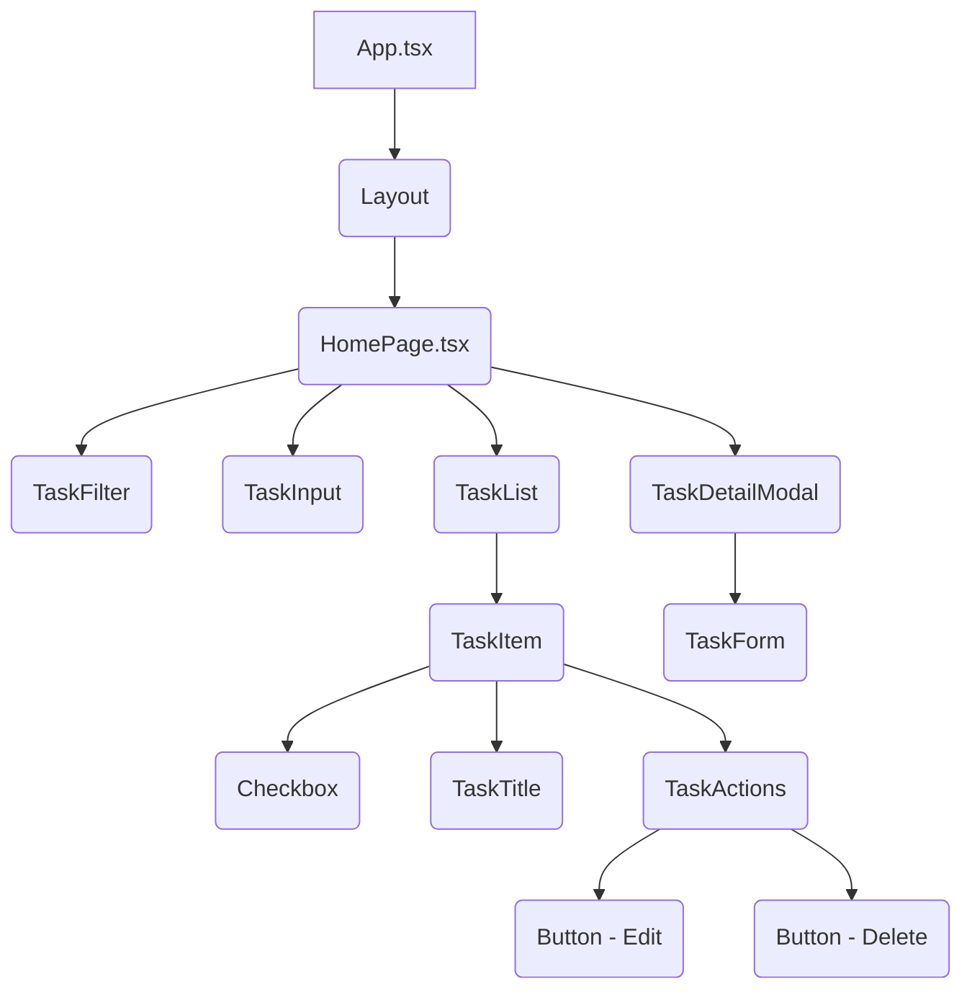

# Architecture Plan: Clean, Modern Todo App

As Victoria, Senior Solutions Architect, I've designed a scalable, clean, and maintainable architecture for your todo application, aligning with the `project_management` archetype and `minimal_light` UI vibe.

## 1. Tech Stack

*   **Frontend:** React (with TypeScript), shadcn/ui (New York v4), Tailwind CSS, TanStack Query (for data fetching).
*   **Backend:** FastAPI (Python), Uvicorn (ASGI server).
*   **Database:** MongoDB (NoSQL document database).
*   **ORM/ODM:** Beanie ODM (for MongoDB with FastAPI).
*   **Deployment:** Docker (for containerization).

## 2. Frontend Component Hierarchy

Leveraging React and shadcn/ui, the frontend will follow a modular component-based structure, reflecting the `project_management` archetype's focus on task visibility and interaction.



*   **`App.tsx`**: Root component, sets up routing and context providers.
*   **`Layout.tsx`**: Provides a consistent page structure (e.g., header, main content area).
*   **`HomePage.tsx`**: The main view for displaying and managing tasks. This serves as the simplified 'board' for our todo app, where filtering acts as column selection.
    *   **`TaskFilter.tsx`**: Buttons/tabs for filtering tasks by status (All, Active, Completed). This replaces the 'Project Sidebar' concept for a simple todo app, providing primary navigation/organization.
    *   **`TaskInput.tsx`**: Input field and button for adding new tasks.
    *   **`TaskList.tsx`**: Container for individual `TaskItem` components.
        *   **`TaskItem.tsx`**: Represents a single task, akin to a 'Task Card'. Displays task title, completion status, and actions (edit, delete).
            *   **`Checkbox`**: To mark task as completed/active.
            *   **`TaskTitle`**: Displays the task's description.
            *   **`TaskActions`**: Grouping for action buttons.
            *   **`Button` (Edit)**: Opens `TaskDetailModal` for editing.
            *   **`Button` (Delete)**: Deletes the task.
    *   **`TaskDetailModal.tsx`**: A modal dialog (shadcn/ui `Dialog` component) for viewing/editing task details. This directly maps to the 'Task Detail Modal' archetype component.
        *   **`TaskForm.tsx`**: Form fields for editing task title and other potential attributes.

## 3. Backend Module Structure

The backend will be structured for clarity and maintainability, following FastAPI's best practices.

```
backend/
├── app/
│   ├── main.py             # FastAPI application entry point
│   ├── config.py           # Application settings (Pydantic BaseSettings)
│   ├── db.py               # Database connection and Beanie initialization
│   ├── models/             # Beanie ODM models
│   │   └── task.py         # Task model definition
│   └── routers/            # API endpoint routers
│       └── tasks.py        # CRUD operations for tasks
├── tests/
│   └── test_tasks.py       # Unit/integration tests
├── .env.example
├── Dockerfile
├── requirements.txt
└── README.md
```

## 4. Database Schema Overview (MongoDB with Beanie ODM)

We will use a single collection, `tasks`, to store todo items. Beanie ODM will provide a Pythonic interface to MongoDB documents.

**`Task` Model (`models/task.py`):**

```python
from datetime import datetime
from typing import Optional

from beanie import Document
from pydantic import Field

class Task(Document):
    title: str = Field(..., min_length=1, max_length=250)
    completed: bool = False
    created_at: datetime = Field(default_factory=datetime.utcnow)
    updated_at: datetime = Field(default_factory=datetime.utcnow)

    class Settings:
        name = "tasks"
        keep_updated_at = True # Beanie automatically updates 'updated_at' on save

    class Config:
        json_schema_extra = {
            "example": {
                "title": "Buy groceries",
                "completed": False
            }
        }
```

## 5. API Endpoints Summary

The API will provide standard RESTful endpoints for managing tasks.

**Base URL:** `/api/v1`

*   **`POST /tasks`**
    *   **Description:** Create a new task.
    *   **Request Body:** `TaskCreate` (Pydantic model: `title: str`).
    *   **Response:** `Task` object (created task).
    *   **Status Codes:** `201 Created`, `422 Unprocessable Entity`.

*   **`GET /tasks`**
    *   **Description:** Retrieve a list of all tasks, with optional filtering.
    *   **Query Parameters:**
        *   `status: Optional[str]` (e.g., `active`, `completed`, `all`). Defaults to `all`.
    *   **Response:** `List[Task]`.
    *   **Status Codes:** `200 OK`.

*   **`GET /tasks/{task_id}`**
    *   **Description:** Retrieve a single task by its ID.
    *   **Path Parameters:** `task_id: PydanticObjectId`.
    *   **Response:** `Task` object.
    *   **Status Codes:** `200 OK`, `404 Not Found`.

*   **`PUT /tasks/{task_id}`**
    *   **Description:** Update an existing task.
    *   **Path Parameters:** `task_id: PydanticObjectId`.
    *   **Request Body:** `TaskUpdate` (Pydantic model: `title: Optional[str]`, `completed: Optional[bool]`).
    *   **Response:** `Task` object (updated task).
    *   **Status Codes:** `200 OK`, `404 Not Found`, `422 Unprocessable Entity`.

*   **`DELETE /tasks/{task_id}`**
    *   **Description:** Delete a task by its ID.
    *   **Path Parameters:** `task_id: PydanticObjectId`.
    *   **Response:** `None`.
    *   **Status Codes:** `204 No Content`, `404 Not Found`.

## 6. Folder Structure

```
. (project root)
├── backend/
│   ├── app/
│   │   ├── main.py
│   │   ├── config.py
│   │   ├── db.py
│   │   ├── models/
│   │   │   └── task.py
│   │   └── routers/
│   │       └── tasks.py
│   ├── tests/
│   │   └── test_tasks.py
│   ├── .env.example
│   ├── Dockerfile
│   └── requirements.txt
├── frontend/
│   ├── public/
│   ├── src/
│   │   ├── App.tsx
│   │   ├── main.tsx
│   │   ├── components/
│   │   │   ├── ui/             # shadcn/ui components
│   │   │   ├── TaskFilter.tsx
│   │   │   ├── TaskInput.tsx
│   │   │   ├── TaskItem.tsx
│   │   │   ├── TaskList.tsx
│   │   │   ├── TaskDetailModal.tsx
│   │   │   └── TaskForm.tsx
│   │   ├── hooks/
│   │   │   └── useTasks.ts     # TanStack Query hook
│   │   ├── lib/
│   │   │   └── utils.ts        # Tailwind/shadcn utilities
│   │   ├── pages/
│   │   │   └── HomePage.tsx
│   │   ├── styles/
│   │   │   └── index.css       # Tailwind CSS entry point
│   │   └── types/
│   │       └── task.ts         # TypeScript types for tasks
│   ├── index.html
│   ├── package.json
│   ├── tailwind.config.js
│   ├── tsconfig.json
│   └── vite.config.ts
├── docker-compose.yml
└── README.md
```

## 7. UI Design System (Minimal Light)

The UI design system is crafted to embody a `minimal_light` aesthetic, focusing on clarity, readability, and a clean user experience, consistent with the `project_management` archetype's need for clear task presentation.

### Color Palette

*   **Primary:** `hsl(222.2 47.4% 11.2%)` (Dark Blue-Gray - for text, primary actions)
*   **Accent:** `hsl(210 40% 96.1%)` (Light Gray - for backgrounds, borders)
*   **Background:** `hsl(0 0% 100%)` (White)
*   **Text:** `hsl(222.2 47.4% 11.2%)` (Dark Blue-Gray)
*   **Muted Text:** `hsl(215 20.2% 65.1%)` (Medium Gray)
*   **Border:** `hsl(214.3 31.8% 91.4%)` (Light Gray)
*   **Success:** `hsl(142.1 76.2% 36.3%)` (Green)
*   **Danger:** `hsl(0 84.2% 60.2%)` (Red)

### Typography

*   **Font Family:** `Inter` (or similar sans-serif for modern readability).
*   **Headings (h1-h3):** Bold, slightly larger, using primary text color.
*   **Body Text:** Regular weight, comfortable reading size (e.g., 16px), using primary text color.
*   **Muted Text:** Smaller, lighter weight, using muted text color.

### Spacing

*   **Base Unit:** `4px` (e.g., `p-1` = 4px, `p-2` = 8px).
*   **Consistent Gaps:** Use `gap-x` and `space-y` for consistent spacing between elements.
*   **Padding:** Generous padding around cards and sections for an airy feel.

### Components (shadcn/ui based)

*   **Buttons:**
    *   **Primary:** Solid background (primary color), white text, subtle hover effect. Rounded corners.
    *   **Secondary:** Outline with light gray border, primary text color, subtle background fill on hover. Rounded corners.
    *   **Ghost/Link:** Text-only, minimal styling, for less prominent actions.
*   **Cards:** White background, subtle border (light gray), rounded corners, soft shadow for depth. Ample internal padding.
*   **Inputs:** Clean, minimal design with light gray border, focus state with a subtle primary color ring.
*   **Checkboxes:** Simple square checkbox, primary color when checked.
*   **Dialogs/Modals:** Centered, white background, rounded corners, soft shadow, clear close button.
*   **Tabs/Filters:** Underlined or pill-shaped active state, subtle hover for inactive states.

### Layout

*   **Centered Content:** Main content area is typically centered and constrained to a max-width for readability.
*   **Clear Sections:** Use cards and distinct background areas to separate logical sections of the application.
*   **Responsive:** Designed to adapt gracefully to various screen sizes.

## UI Tokens (machine readable)

```json
{
  "vibe": "minimal_light",
  "classes": {
    "pageBg": "bg-background text-foreground",
    "card": "bg-card text-card-foreground rounded-lg border shadow-sm",
    "primaryButton": "bg-primary text-primary-foreground hover:bg-primary/90 inline-flex items-center justify-center whitespace-nowrap rounded-md text-sm font-medium ring-offset-background transition-colors focus-visible:outline-none focus-visible:ring-2 focus-visible:ring-ring focus-visible:ring-offset-2 disabled:pointer-events-none disabled:opacity-50 h-10 px-4 py-2",
    "secondaryButton": "border border-input bg-background hover:bg-accent hover:text-accent-foreground inline-flex items-center justify-center whitespace-nowrap rounded-md text-sm font-medium ring-offset-background transition-colors focus-visible:outline-none focus-visible:ring-2 focus-visible:ring-ring focus-visible:ring-offset-2 disabled:pointer-events-none disabled:opacity-50 h-10 px-4 py-2",
    "mutedText": "text-muted-foreground"
  }
}
```