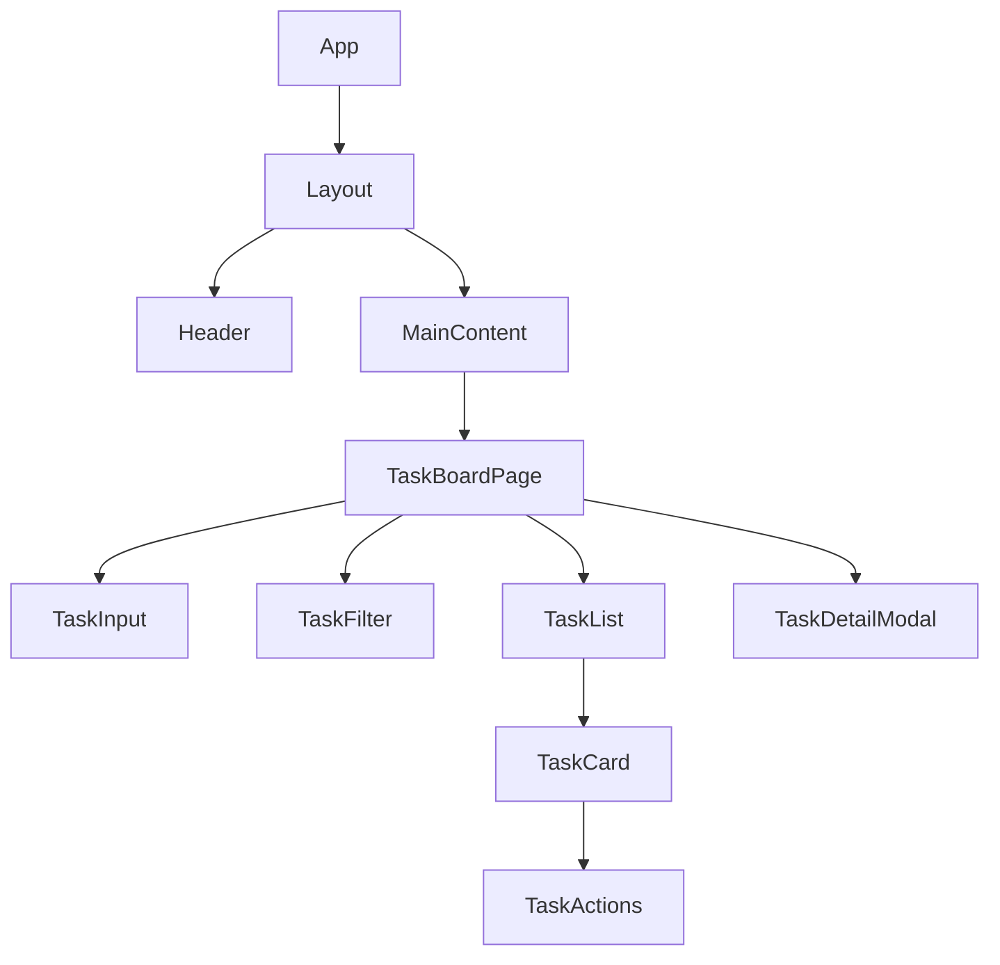

# Architecture Plan: Clean, Modern Todo App

## 1. Overview
This document outlines the high-level architecture for a clean, modern todo application. The application will allow users to add, complete, delete, and filter tasks. The design emphasizes a `minimal_light` aesthetic and adapts `project_management` archetype patterns for a streamlined user experience.

## 2. Tech Stack

*   **Frontend**: React (with TypeScript), Vite, Tailwind CSS, shadcn/ui (New York v4).
*   **Backend**: FastAPI (Python), Pydantic, Beanie ODM.
*   **Database**: MongoDB.
*   **Deployment**: Docker (recommended for containerization).

## 3. Frontend Component Hierarchy

The frontend is built with React and leverages `shadcn/ui` for a consistent, minimal aesthetic. The structure is adapted from the `project_management` archetype, focusing on a single, filterable task list.



*   **`App`**: Root component.
*   **`Layout`**: Provides overall page structure (e.g., header, main content area).
*   **`Header`**: Application title and potential global actions.
*   **`MainContent`**: Contains the primary application view.
*   **`TaskBoardPage`**: The main view displaying tasks, acting as a simplified 'Kanban Board' for a single list of tasks.
    *   **`TaskInput`**: Component for adding new tasks.
    *   **`TaskFilter`**: Controls for filtering tasks by status (All, Active, Completed).
    *   **`TaskList`**: Container for individual `TaskCard` components.
        *   **`TaskCard`**: Displays a single task with its title, status, and actions.
            *   **`TaskActions`**: Buttons/icons for marking as complete, editing, or deleting a task.
    *   **`TaskDetailModal`**: A modal for viewing/editing detailed task information (e.g., description).

## 4. Backend Module Structure

The backend is a FastAPI application, structured for modularity and maintainability.

```
backend/
├── app/
│   ├── core/                  # Core configurations and utilities
│   │   ├── config.py          # Application settings
│   │   └── database.py        # MongoDB connection and Beanie initialization
│   ├── models/                # Beanie ODM documents
│   │   └── task.py            # Task Document definition
│   ├── schemas/               # Pydantic models for request/response validation
│   │   └── task.py            # Schemas for Task creation, update, and response
│   └── api/                   # API routes
│       └── v1/                # API version 1
│           └── endpoints/     # Specific API endpoints
│               └── tasks.py   # CRUD operations for tasks
├── main.py                    # FastAPI application entry point
└── requirements.txt           # Python dependencies
```

## 5. Database Schema Overview (MongoDB + Beanie ODM)

We will use MongoDB as the NoSQL database, with Beanie ODM for Pythonic data modeling and interaction. The primary entity is `Task`.

### `Task` Document

```python
# app/models/task.py
from datetime import datetime
from typing import Optional, Literal
from beanie import Document

class Task(Document):
    title: str
    description: Optional[str] = None
    status: Literal["active", "completed"] = "active"
    created_at: datetime = Field(default_factory=datetime.utcnow)
    updated_at: datetime = Field(default_factory=datetime.utcnow)

    class Settings:
        name = "tasks"
        # Optional: Add indexes if needed, e.g., for faster filtering by status
        # indexes = [
        #     "status"
        # ]
```

## 6. API Endpoints Summary

All API endpoints will be prefixed with `/api/v1`. Pydantic schemas will be used for request body validation and response serialization.

*   **`POST /api/v1/tasks`**
    *   **Description**: Create a new task.
    *   **Request Body**: `TaskCreate` schema (title, optional description).
    *   **Response**: `TaskResponse` schema (created task details).
    *   **Status Codes**: `201 Created`.

*   **`GET /api/v1/tasks`**
    *   **Description**: Retrieve a list of all tasks, with optional filtering by status.
    *   **Query Parameters**: `status: Optional[Literal["active", "completed"]]`
    *   **Response**: `List[TaskResponse]` schema.
    *   **Status Codes**: `200 OK`.

*   **`GET /api/v1/tasks/{task_id}`**
    *   **Description**: Retrieve a single task by its ID.
    *   **Path Parameters**: `task_id: PydanticObjectId`
    *   **Response**: `TaskResponse` schema.
    *   **Status Codes**: `200 OK`, `404 Not Found`.

*   **`PUT /api/v1/tasks/{task_id}`**
    *   **Description**: Update an existing task.
    *   **Path Parameters**: `task_id: PydanticObjectId`
    *   **Request Body**: `TaskUpdate` schema (optional title, description, status).
    *   **Response**: `TaskResponse` schema (updated task details).
    *   **Status Codes**: `200 OK`, `404 Not Found`.

*   **`DELETE /api/v1/tasks/{task_id}`**
    *   **Description**: Delete a task by its ID.
    *   **Path Parameters**: `task_id: PydanticObjectId`
    *   **Response**: `204 No Content`.
    *   **Status Codes**: `204 No Content`, `404 Not Found`.

## 7. Folder Structure

```
. (project root)
├── backend/
│   ├── app/
│   │   ├── core/
│   │   ├── models/
│   │   ├── schemas/
│   │   └── api/
│   │       └── v1/
│   │           └── endpoints/
│   ├── main.py
│   └── requirements.txt
├── frontend/
│   ├── public/
│   ├── src/
│   │   ├── assets/
│   │   ├── components/
│   │   │   ├── ui/             # shadcn/ui generated components
│   │   │   ├── TaskCard.tsx
│   │   │   ├── TaskInput.tsx
│   │   │   ├── TaskFilter.tsx
│   │   │   ├── TaskDetailModal.tsx
│   │   │   └── Layout.tsx
│   │   ├── lib/                # Utility functions, API client
│   │   ├── hooks/              # Custom React hooks
│   │   ├── context/            # React Context for global state (e.g., TaskContext)
│   │   ├── pages/
│   │   │   └── TaskBoardPage.tsx # Main task display page
│   │   ├── App.tsx
│   │   ├── main.tsx
│   │   ├── index.css           # Tailwind base styles
│   │   └── globals.css         # shadcn/ui and custom global styles
│   ├── package.json
│   ├── tailwind.config.js
│   └── tsconfig.json
└── README.md
```

## 8. UI Design System

**Vibe**: `minimal_light`
**Base Framework**: `shadcn/ui` (New York v4 theme)

The design system focuses on cleanliness, readability, and a light, airy feel. It prioritizes content and ease of use, with subtle visual cues.

### Key Design Principles:

*   **Whitespace**: Generous use of padding and margins to create breathing room.
*   **Typography**: Clean, sans-serif fonts for excellent readability.
*   **Color Palette**: Predominantly whites, light grays, and a single, muted accent color for interactive elements.
*   **Borders & Shadows**: Minimal, subtle borders and soft shadows to define elements without heaviness.
*   **Interactivity**: Clear hover states and focus indicators for user feedback.

### UI Tokens (machine readable)

```json
{
  "vibe": "minimal_light",
  "classes": {
    "pageBg": "bg-background text-foreground",
    "card": "bg-card text-card-foreground shadow-sm rounded-lg border border-input",
    "primaryButton": "bg-primary text-primary-foreground hover:bg-primary/90",
    "secondaryButton": "bg-secondary text-secondary-foreground hover:bg-secondary/80",
    "mutedText": "text-muted-foreground"
  }
}
```

### Component Styling Guidelines (using shadcn/ui):

*   **Buttons**: Use `Button` component. Primary actions use `variant="default"`, secondary actions use `variant="secondary"` or `variant="outline"`.
*   **Inputs**: Use `Input` component. Focus states should be subtle but clear.
*   **Cards**: Use `Card` component for task items. Keep them clean with minimal internal padding.
*   **Modals/Dialogs**: Use `Dialog` component for `TaskDetailModal`.
*   **Typography**: Headings (`h1`, `h2`, etc.) should be clear and concise. Body text should be highly readable.
*   **Icons**: Use a consistent icon library (e.g., Lucide React, integrated with shadcn/ui) for actions like delete, complete, edit.
*   **Filtering**: Use `ToggleGroup` or `Button` components for status filters, ensuring clear active states.
