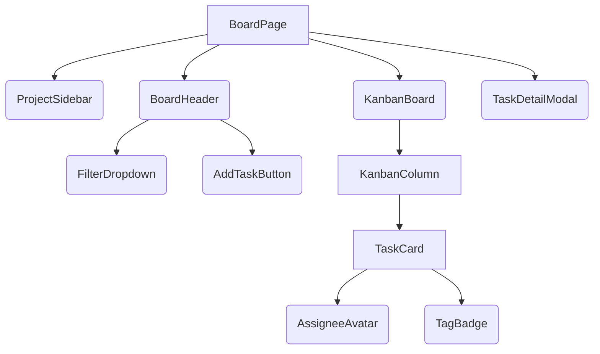

# Kanban Board Architecture Plan

As Senior Solutions Architect, I've designed a scalable, clean, and maintainable architecture for your Kanban board application, aligning with the `project_management` archetype and `modern_gradient` UI vibe.

## 1. Tech Stack

*   **Frontend**: React.js, TypeScript, shadcn/ui (New York v4), Tailwind CSS, TanStack Query (for data fetching and state management).
*   **Backend**: FastAPI (Python), Beanie ODM (for MongoDB object-document mapping), Pydantic.
*   **Database**: MongoDB (NoSQL document database).
*   **Containerization (Optional but Recommended)**: Docker.

## 2. Frontend Component Hierarchy

The frontend is structured to provide a rich, interactive Kanban experience, leveraging shadcn/ui components styled for a `modern_gradient` aesthetic.



*   **`BoardPage`**: The main view for displaying the Kanban board.
*   **`ProjectSidebar`**: (Optional, but good for `project_management` archetype) Left-hand navigation for switching between projects or views.
*   **`BoardHeader`**: Contains the board title, global actions (e.g., add task), and filtering options.
    *   **`FilterDropdown`**: Allows filtering tasks by assignee and tags.
    *   **`AddTaskButton`**: Initiates the creation of a new task.
*   **`KanbanBoard`**: The main container for all columns, handling drag-and-drop logic between columns.
    *   **`KanbanColumn`**: Represents a single column (e.g., Backlog, In Progress). It's a droppable area and contains multiple `TaskCard` components.
        *   **`TaskCard`**: Represents an individual task. It's a draggable component displaying key task information.
            *   **`AssigneeAvatar`**: Displays the assigned user's avatar.
            *   **`TagBadge`**: Displays associated tags.
*   **`TaskDetailModal`**: A modal dialog for viewing and editing the full details of a selected task.

## 3. Backend Module Structure

The backend follows a clean, modular structure using FastAPI, emphasizing separation of concerns.

```
backend/
├── main.py                 # FastAPI application entry point
├── app/
│   ├── core/               # Configuration, database connection
│   │   ├── config.py       # Environment variables, settings
│   │   └── database.py     # Beanie ODM initialization, MongoDB connection
│   ├── models/             # Beanie ODM document models
│   │   ├── task.py
│   │   ├── column.py
│   │   ├── user.py         # For assignees
│   │   └── tag.py
│   ├── schemas/            # Pydantic schemas for request/response validation
│   │   ├── task.py         # TaskCreate, TaskUpdate, TaskResponse
│   │   ├── column.py
│   │   ├── user.py
│   │   └── tag.py
│   ├── api/                # FastAPI routers for API endpoints
│   │   └── v1/
│   │       ├── tasks.py    # Task CRUD, move operations
│   │       ├── columns.py  # Column CRUD, reordering
│   │       ├── users.py    # User (assignee) endpoints
│   │       └── tags.py     # Tag CRUD
│   └── services/           # Business logic, if complex operations are needed
│       └── task_service.py # E.g., complex task creation, status transitions
└── requirements.txt        # Python dependencies
```

## 4. Database Schema Overview (MongoDB with Beanie ODM)

We will use MongoDB as the NoSQL database, with Beanie ODM providing Pythonic object-document mapping and schema validation.

### `Task` Document

```python
from beanie import Document, PydanticObjectId
from datetime import datetime
from typing import List, Optional

class Task(Document):
    title: str
    description: Optional[str] = None
    column_id: PydanticObjectId  # Reference to Column
    assignee_id: Optional[PydanticObjectId] = None # Reference to User
    tags: List[PydanticObjectId] = [] # References to Tag
    order: int # For ordering tasks within a column
    created_at: datetime = Field(default_factory=datetime.utcnow)
    updated_at: datetime = Field(default_factory=datetime.utcnow)

    class Settings:
        name = "tasks"
```

### `Column` Document

```python
from beanie import Document
from typing import Optional

class Column(Document):
    title: str
    order: int # For ordering columns on the board
    project_id: Optional[PydanticObjectId] = None # For multi-project support

    class Settings:
        name = "columns"
```

### `User` Document (for Assignees)

```python
from beanie import Document
from typing import Optional

class User(Document):
    name: str
    email: str
    avatar_url: Optional[str] = None

    class Settings:
        name = "users"
```

### `Tag` Document

```python
from beanie import Document
from typing import Optional

class Tag(Document):
    name: str
    color: Optional[str] = None # E.g., hex code for UI display

    class Settings:
        name = "tags"
```

## 5. API Endpoints Summary

All endpoints will be prefixed with `/api/v1`.

### Tasks

*   `GET /tasks`: Retrieve all tasks, with optional filters (`assignee_id`, `tag_id`, `column_id`).
*   `GET /tasks/{task_id}`: Retrieve a single task by ID.
*   `POST /tasks`: Create a new task.
*   `PUT /tasks/{task_id}`: Update an existing task.
*   `DELETE /tasks/{task_id}`: Delete a task.
*   `PATCH /tasks/{task_id}/move`: Update a task's `column_id` and `order` for drag-and-drop operations.

### Columns

*   `GET /columns`: Retrieve all columns, ordered by `order` field.
*   `POST /columns`: Create a new column.
*   `PUT /columns/{column_id}`: Update a column (e.g., title, order).
*   `DELETE /columns/{column_id}`: Delete a column.

### Users (Assignees)

*   `GET /users`: Retrieve all users (primarily for assignee selection).

### Tags

*   `GET /tags`: Retrieve all tags.
*   `POST /tags`: Create a new tag.

## 6. Folder Structure

### Frontend (`frontend/src/`)

```
frontend/src/
├── pages/
│   └── BoardPage.tsx       # Main Kanban board view
├── components/
│   ├── ui/                 # shadcn/ui components (auto-generated)
│   ├── KanbanBoard.tsx
│   ├── KanbanColumn.tsx
│   ├── TaskCard.tsx
│   ├── TaskDetailModal.tsx
│   ├── BoardHeader.tsx
│   ├── FilterDropdown.tsx
│   ├── AddTaskButton.tsx
│   ├── AssigneeAvatar.tsx
│   └── TagBadge.tsx
├── context/
│   └── BoardContext.tsx    # React Context for board-wide state (e.g., drag state)
├── hooks/
│   └── useBoardData.ts     # Custom hook for fetching/mutating board data with TanStack Query
├── lib/
│   └── utils.ts            # Utility functions (e.g., cn for Tailwind class merging)
├── styles/
│   └── globals.css         # Tailwind CSS base styles
└── App.tsx                 # Root component
```

### Backend (`backend/`)

(See Section 3: Backend Module Structure for detailed breakdown)

## 7. UI Design System

**Vibe**: `modern_gradient`
**Archetype**: `project_management`

The UI design system embraces a `modern_gradient` aesthetic, characterized by subtle gradients, soft shadows, rounded corners, and a clean, spacious layout. Colors will lean towards harmonious blues, purples, and grays, with vibrant accents for interactive elements. Typography will be modern sans-serif, ensuring readability and a professional feel.

### Key Design Principles:

*   **Gradients**: Used subtly for backgrounds, buttons, and borders to add depth and a modern touch.
*   **Softness**: Rounded corners and gentle shadows create a friendly and approachable interface.
*   **Clarity**: Ample whitespace and clear typography ensure tasks and information are easily digestible.
*   **Interactivity**: Hover states and transitions will be smooth and visually engaging.

### Component Styling (shadcn/ui with Tailwind CSS):

*   **Page Background**: A light, subtle gradient that provides a fresh, modern base.
*   **Cards (Tasks/Columns)**: Clean white/light gray background, rounded corners, and a soft shadow to lift them off the background, possibly with a subtle gradient border on hover.
*   **Buttons**: Primary actions feature a vibrant gradient background, while secondary actions are more subdued with borders.
*   **Inputs/Selects**: Minimalist design with clear focus states, possibly a subtle gradient border on focus.
*   **Avatars**: Circular, perhaps with a thin gradient ring.
*   **Badges**: Rounded, with soft, distinct colors for tags.

## UI Tokens (machine readable)

```json
{
  