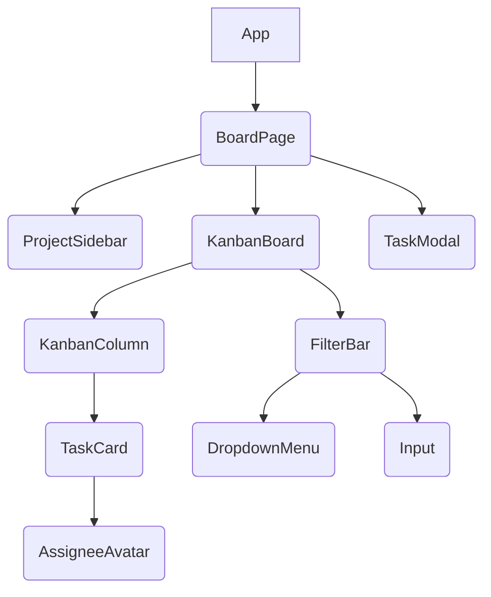

# Kanban Board Architecture Plan

## 1. Overview
This document outlines the high-level architecture for a Kanban board application, enabling users to manage tasks across various columns (Backlog, In Progress, Review, Done). Key features include task creation, drag-and-drop functionality for status changes, and filtering by assignee and tag. The design prioritizes scalability, maintainability, and a modern user experience aligned with the 'modern_gradient' aesthetic and 'project_management' archetype.

## 2. Tech Stack

*   **Frontend**: React (with TypeScript), shadcn/ui (New York v4), Tailwind CSS, React DnD (for drag-and-drop functionality), Zustand (for global state management).
*   **Backend**: FastAPI (Python), Pydantic (for data validation), Beanie ODM (for MongoDB object-document mapping).
*   **Database**: MongoDB (NoSQL document database).
*   **Deployment**: Docker (containerization), potentially Kubernetes for orchestration.

## 3. Frontend Component Hierarchy

Leveraging shadcn/ui and React, the frontend will be structured to provide a fluid and interactive user experience, reflecting the `project_management` archetype's focus on clear organization and `modern_gradient`'s visual appeal.



*   **`App`**: Root component, handles routing and global context providers.
*   **`BoardPage`**: The main view for the Kanban board, orchestrates `ProjectSidebar`, `KanbanBoard`, and `TaskModal`.
*   **`ProjectSidebar`**: (Placeholder for future expansion) Left-hand navigation for projects/workspaces. For this iteration, it might contain a simple logo or project title.
*   **`KanbanBoard`**: The container for all Kanban columns, manages drag-and-drop logic and overall board state.
*   **`FilterBar`**: Allows users to filter tasks by assignee and tags. Utilizes shadcn/ui `DropdownMenu` and `Input` components.
*   **`KanbanColumn`**: Represents a single status column (Backlog, In Progress, Review, Done). Contains a list of `TaskCard` components.
*   **`TaskCard`**: Displays a summary of a task (title, assignee, tags, priority). Draggable and clickable to open `TaskModal`.
*   **`TaskModal`**: A modal dialog for creating new tasks or viewing/editing existing task details (description, due date, assignee, tags, priority).
*   **`AssigneeAvatar`**: Reusable component to display an assignee's avatar and name.

## 4. Backend Module Structure

The backend will be built with FastAPI, following a modular and layered approach to separate concerns.

```
backend/
├── main.py                 # FastAPI application entry point
├── app/
│   ├── core/               # Configuration, database connection, middleware
│   │   ├── config.py
│   │   └── database.py
│   ├── models/             # Beanie ODM models for MongoDB
│   │   ├── task.py
│   │   ├── user.py
│   │   └── tag.py
│   ├── schemas/            # Pydantic schemas for request/response validation
│   │   ├── task.py
│   │   ├── user.py
│   │   └── tag.py
│   ├── services/           # Business logic, data manipulation
│   │   ├── task_service.py
│   │   ├── user_service.py
│   │   └── tag_service.py
│   ├── api/
│   │   └── v1/
│   │       ├── endpoints/  # API route handlers
│   │       │   ├── tasks.py
│   │       │   ├── users.py
│   │       │   └── tags.py
│   │       └── __init__.py # API router aggregation
│   └── __init__.py
├── tests/
│   ├── api/
│   └── services/
└── requirements.txt
```

## 5. Database Schema Overview (MongoDB with Beanie ODM)

Beanie ODM will be used to define the MongoDB document structures, ensuring type safety and ease of interaction.

### `Task` Model
Represents an individual task on the Kanban board.

```python
from datetime import datetime
from typing import List, Literal, Optional
from beanie import Document, Link, PydanticObjectId

class Task(Document):
    title: str
    description: Optional[str] = None
    status: Literal["Backlog", "In Progress", "Review", "Done"] = "Backlog"
    priority: Literal["Low", "Medium", "High"] = "Medium"
    assignee: Optional[Link["User"]] = None  # Link to User model
    tags: List[Link["Tag"]] = []          # List of links to Tag model
    due_date: Optional[datetime] = None
    created_at: datetime = Field(default_factory=datetime.utcnow)
    updated_at: datetime = Field(default_factory=datetime.utcnow)

    class Settings:
        name = "tasks"
        # Indexes for efficient filtering
        indexes = [
            "status",
            "assignee",
            "tags",
            ("status", "assignee"),
            ("status", "tags")
        ]
```

### `User` Model
Represents a user who can be assigned tasks.

```python
from beanie import Document

class User(Document):
    name: str
    email: str

    class Settings:
        name = "users"
        indexes = [
            "email"
        ]
```

### `Tag` Model
Represents a tag that can be applied to tasks.

```python
from beanie import Document
from typing import Optional

class Tag(Document):
    name: str
    color: Optional[str] = None # Hex code or Tailwind color class

    class Settings:
        name = "tags"
        indexes = [
            "name"
        ]
```

## 6. API Endpoints Summary

All API endpoints will be prefixed with `/api/v1`. Pydantic schemas will be used for request body validation and response serialization.

### Tasks
*   `GET /tasks`: Retrieve all tasks, with optional query parameters for filtering by `status`, `assignee_id`, and `tag_ids`.
    *   Response: `List[TaskReadSchema]`
*   `GET /tasks/{task_id}`: Retrieve a single task by ID.
    *   Response: `TaskReadSchema`
*   `POST /tasks`: Create a new task.
    *   Request: `TaskCreateSchema`
    *   Response: `TaskReadSchema`
*   `PUT /tasks/{task_id}`: Update an existing task by ID.
    *   Request: `TaskUpdateSchema`
    *   Response: `TaskReadSchema`
*   `PATCH /tasks/{task_id}/status`: Update only the status of a task (for drag-and-drop).
    *   Request: `{"status": "New Status"}`
    *   Response: `TaskReadSchema`
*   `DELETE /tasks/{task_id}`: Delete a task by ID.
    *   Response: `{"message": "Task deleted"}`

### Users
*   `GET /users`: Retrieve all users (primarily for assignee selection).
    *   Response: `List[UserReadSchema]`
*   `POST /users`: Create a new user.
    *   Request: `UserCreateSchema`
    *   Response: `UserReadSchema`

### Tags
*   `GET /tags`: Retrieve all tags.
    *   Response: `List[TagReadSchema]`
*   `POST /tags`: Create a new tag.
    *   Request: `TagCreateSchema`
    *   Response: `TagReadSchema`

## 7. UI Design System (Modern Gradient for Project Management)

The UI design system is crafted to align with the `modern_gradient` vibe, featuring deep, rich colors, subtle gradients, and clean typography. The `project_management` archetype dictates a clear, organized layout with emphasis on task visibility and interaction.

### Color Palette
*   **Primary Accent**: Vibrant purples and blues, used for interactive elements and highlights.
*   **Secondary Accent**: Muted greens or oranges for status indicators or secondary actions.
*   **Backgrounds**: Dark, deep grays with subtle gradients to provide depth and a premium feel.
*   **Text**: Light grays and whites for readability against dark backgrounds.

### Typography
*   **Font Family**: A clean, modern sans-serif (e.g., Inter, Poppins) for all text.
*   **Headings**: Bold and slightly larger, using primary accent colors or gradients.
*   **Body Text**: Regular weight, good contrast for readability.

### Components & Layout
*   **Kanban Board**: Columns will have distinct, slightly darker backgrounds than the main page, with subtle borders. Task cards will float within columns, featuring rounded corners and soft shadows.
*   **Task Cards**: Compact, displaying essential information (title, assignee, tags, priority). Hover effects will be subtle gradients or slight lifts.
*   **Modals**: Full-screen or large modals with a frosted glass effect or a distinct dark background, ensuring focus on task details.
*   **Buttons**: Primary buttons will feature a prominent gradient fill, while secondary buttons will be more subdued (outlined or solid dark fill).
*   **Inputs**: Clean, dark inputs with subtle borders and focus states that highlight with an accent color.
*   **Layout**: A clear two-column layout for the `BoardPage`, with a fixed-width sidebar (even if minimal for this iteration) and a flexible main content area for the Kanban board.

### UI Tokens (machine readable)

```json
{
  