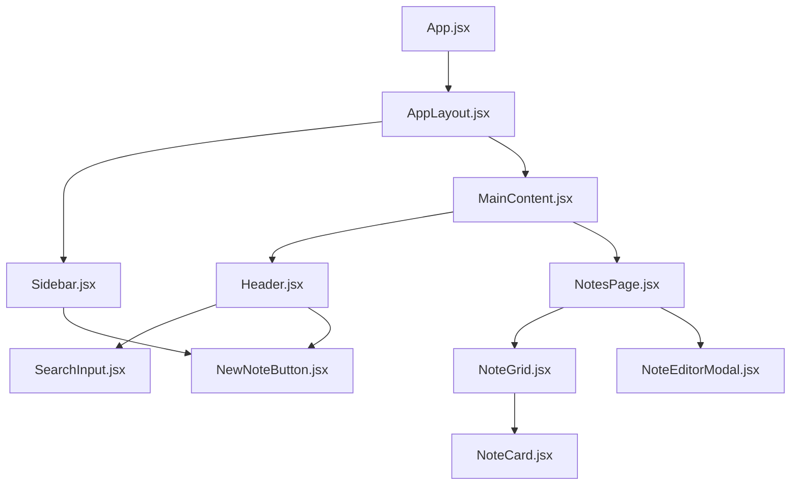

# Architecture Plan: Dark Hacker Notes Manager

As Victoria, Senior Solutions Architect, I've designed a scalable, clean, and maintainable architecture for your Notes Manager. This plan leverages the `dark_hacker` UI vibe and adapts structural elements from the `project_management` archetype to provide a robust and aesthetically aligned application.

## 1. Tech Stack

*   **Frontend**: React.js, Vite, TypeScript, Tailwind CSS, shadcn/ui (New York v4 theme)
*   **Backend**: FastAPI, Pydantic
*   **Database**: MongoDB
*   **ODM (Object Document Mapper)**: Beanie (for MongoDB)

## 2. Frontend Component Hierarchy

The frontend is structured to provide a responsive and intuitive user experience, incorporating a sidebar for navigation/filters and a main content area for note management, aligning with the `project_management` archetype's layout.



*   **`App.jsx`**: Root component, handles global context providers (e.g., theme).
*   **`AppLayout.jsx`**: Defines the overall page structure, including a persistent `Sidebar` and `MainContent` area.
*   **`Sidebar.jsx`**: Contains navigation links, filters (e.g., by tags), and a `NewNoteButton` for quick note creation.
*   **`MainContent.jsx`**: Houses the `Header` and the primary `NotesPage` content.
*   **`Header.jsx`**: Top bar containing the `SearchInput` for notes and potentially user settings/profile.
*   **`SearchInput.jsx`**: Dedicated component for searching notes by title.
*   **`NotesPage.jsx`**: The main view for displaying and managing notes. Orchestrates `NoteGrid` and `NoteEditorModal`.
*   **`NoteGrid.jsx`**: Displays notes in a responsive grid layout, rendering multiple `NoteCard` components.
*   **`NoteCard.jsx`**: Represents an individual note, displaying its title, a snippet of content, and actions (edit, delete).
*   **`NoteEditorModal.jsx`**: A modal dialog for creating new notes or editing existing ones.
*   **`NewNoteButton.jsx`**: A button (likely in the sidebar or header) to trigger the `NoteEditorModal` for new note creation.

## 3. Backend Module Structure

The backend is built with FastAPI, ensuring clear separation of concerns and maintainability.

```
backend/
├── main.py
├── config.py
├── database.py
├── models/
│   └── note.py
├── schemas/
│   └── note.py
├── api/
│   └── v1/
│       └── endpoints/
│           └── notes.py
└── requirements.txt
```

*   **`main.py`**: Entry point for the FastAPI application, initializes the database connection and includes API routers.
*   **`config.py`**: Manages application settings, environment variables, and database connection strings.
*   **`database.py`**: Handles Beanie ODM initialization and connection to MongoDB.
*   **`models/note.py`**: Defines the `Note` Beanie Document, mapping Python objects to MongoDB documents.
*   **`schemas/note.py`**: Contains Pydantic models for request validation (e.g., `NoteCreate`, `NoteUpdate`) and response serialization (e.g., `NoteResponse`).
*   **`api/v1/endpoints/notes.py`**: Implements the API routes and business logic for notes (CRUD, search).

## 4. Database Schema Overview (MongoDB + Beanie ODM)

Using Beanie ODM, the `Note` document will be defined as follows:

```python
# models/note.py
from datetime import datetime
from typing import Optional, List
from beanie import Document

class Note(Document):
    title: str
    content: str
    tags: Optional[List[str]] = []
    created_at: datetime = Field(default_factory=datetime.utcnow)
    updated_at: datetime = Field(default_factory=datetime.utcnow)

    class Settings:
        name = "notes"
        # Optional: Add indexes for performance, e.g., on title for search
        indexes = [
            "title",
            [("title", "text"), ("content", "text")] # Text index for search
        ]
```

*   **`_id`**: MongoDB's default `ObjectId` (auto-generated by Beanie).
*   **`title`**: `str`, the title of the note.
*   **`content`**: `str`, the main body of the note.
*   **`tags`**: `Optional[List[str]]`, an array of strings for categorization and filtering.
*   **`created_at`**: `datetime`, timestamp of note creation.
*   **`updated_at`**: `datetime`, timestamp of last update.

## 5. API Endpoints Summary

All endpoints will be prefixed with `/api/v1`.

*   **`POST /notes`**
    *   **Description**: Create a new note.
    *   **Request Body**: `NoteCreate` schema (title, content, tags).
    *   **Response**: `NoteResponse` schema (created note details).
*   **`GET /notes`**
    *   **Description**: Retrieve all notes, with optional search and pagination.
    *   **Query Params**: `q: str` (search by title/content), `skip: int`, `limit: int`.
    *   **Response**: `List[NoteResponse]`.
*   **`GET /notes/{note_id}`**
    *   **Description**: Retrieve a specific note by its ID.
    *   **Path Params**: `note_id: PydanticObjectId`.
    *   **Response**: `NoteResponse`.
*   **`PUT /notes/{note_id}`**
    *   **Description**: Update an existing note by its ID.
    *   **Path Params**: `note_id: PydanticObjectId`.
    *   **Request Body**: `NoteUpdate` schema (partial update of title, content, tags).
    *   **Response**: `NoteResponse` (updated note details).
*   **`DELETE /notes/{note_id}`**
    *   **Description**: Delete a note by its ID.
    *   **Path Params**: `note_id: PydanticObjectId`.
    *   **Response**: `dict` (confirmation message).

## 6. Folder Structure

```
.gitignore
README.md

backend/
├── main.py
├── config.py
├── database.py
├── models/
│   └── note.py
├── schemas/
│   └── note.py
├── api/
│   └── v1/
│       └── endpoints/
│           └── notes.py
└── requirements.txt

frontend/
├── public/
│   └── vite.svg
├── src/
│   ├── App.tsx
│   ├── main.tsx
│   ├── index.css
│   ├── lib/
│   │   ├── utils.ts
│   │   └── shadcn-ui/
│   │       └── components/
│   │           └── ui/ (shadcn components like button, card, dialog, input, etc.)
│   ├── components/
│   │   ├── layout/
│   │   │   ├── AppLayout.tsx
│   │   │   └── Sidebar.tsx
│   │   ├── notes/
│   │   │   ├── NoteGrid.tsx
│   │   │   ├── NoteCard.tsx
│   │   │   └── NoteEditorModal.tsx
│   │   ├── common/
│   │   │   ├── Header.tsx
│   │   │   └── SearchInput.tsx
│   │   └── ui/ (custom UI components built on shadcn, e.g., NewNoteButton.tsx)
│   ├── pages/
│   │   └── NotesPage.tsx
│   ├── hooks/
│   │   └── useNotes.ts (for data fetching/mutation)
│   ├── services/
│   │   └── notes.ts (API client for notes)
│   └── context/
│       └── ThemeProvider.tsx (for dark mode management)
├── tailwind.config.js
├── postcss.config.js
├── tsconfig.json
├── vite-env.d.ts
└── package.json
```

## 7. UI Design System: Dark Hacker Notes

The UI design system is crafted to embody the `dark_hacker` vibe, characterized by deep dark backgrounds, vibrant neon accents, monospace typography, and a focus on clarity and functionality. It integrates shadcn/ui (New York v4) as its foundation, customizing it to fit the aesthetic.

### General Principles
*   **Color Palette**: Predominantly dark grays and blacks (`gray-950`, `gray-900`, `gray-800`) with striking neon accents (e.g., `green-500`, `cyan-500`, `purple-500`) for interactive elements and highlights.
*   **Typography**: Monospace fonts (e.g., `Fira Code`, `JetBrains Mono`, `IBM Plex Mono`) for a terminal-like feel. Light gray or white for primary text, neon for emphasis.
*   **Borders & Shadows**: Subtle, sharp borders. Minimal, contained shadows that hint at depth without being overly soft.
*   **Interactivity**: Clear hover states, glowing focus rings, and subtle transitions to indicate interaction.
*   **Layout**: A clean, structured layout with a distinct sidebar and main content area, providing a sense of organized control.

### Component Styling

*   **Page Background**: Deep, almost black background for a truly immersive dark experience.
*   **Cards (Notes)**: Darker background than the page, with a subtle border that glows neon on hover or selection. Monospace title, muted content preview.
*   **Buttons**: Primary buttons feature a vibrant neon background with white text, while secondary buttons are dark gray with light gray text and a subtle border. Both use monospace fonts and have distinct hover/focus states.
*   **Inputs/Search Bar**: Dark background, light text, with a neon border on focus to draw attention.
*   **Text**: Primary text is light gray/white. Muted text (e.g., timestamps, tags) is a darker gray. Highlighted text (e.g., active links) uses neon colors.
*   **Icons**: Simple, sharp, monochromatic icons that complement the monospace aesthetic.

### UI Tokens (machine readable)

```json
{
  