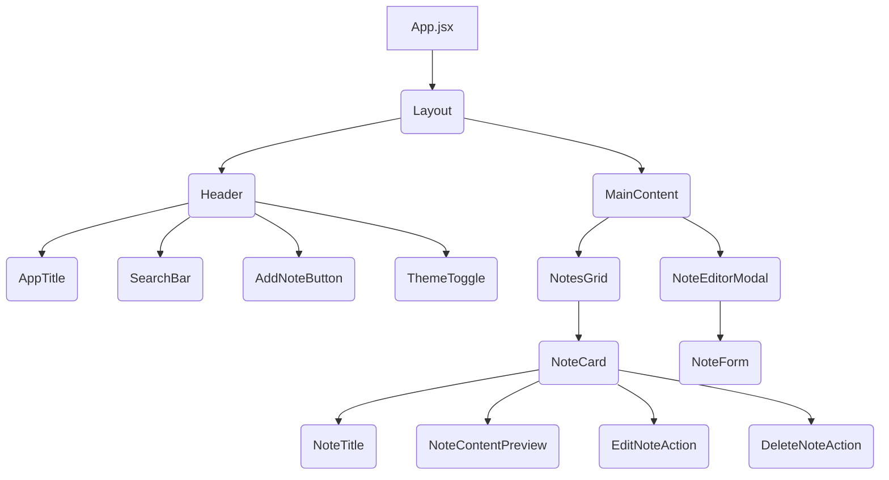

# Notes Manager Architecture Plan

As Victoria, Senior Solutions Architect, I've designed a scalable, clean, and maintainable architecture for your Notes Manager application. This plan leverages modern technologies and best practices, tailored to the `notes_manager` archetype with a `dark_hacker` UI vibe.

## 1. Tech Stack

*   **Frontend**: React.js, shadcn/ui (New York v4), Tailwind CSS, Zustand (for state management)
*   **Backend**: FastAPI, Pydantic, Beanie ODM
*   **Database**: MongoDB
*   **Deployment**: Docker (for containerization)

## 2. Frontend Component Hierarchy

The frontend is structured to provide an intuitive user experience for managing notes, focusing on a grid layout and efficient interaction.



*   **`App.jsx`**: Root component, sets up context providers and routing.
*   **`Layout.jsx`**: Provides the overall page structure, including `Header` and `MainContent` areas.
*   **`Header.jsx`**: Contains global navigation and actions like the app title, search bar, add note button, and theme toggle.
*   **`SearchBar.jsx`**: Input field for searching notes by title.
*   **`AddNoteButton.jsx`**: Triggers the `NoteEditorModal` for creating a new note.
*   **`MainContent.jsx`**: The primary area displaying the `NotesGrid` and potentially the `NoteEditorModal`.
*   **`NotesGrid.jsx`**: A container component responsible for fetching and rendering a collection of `NoteCard` components in a responsive grid layout.
*   **`NoteCard.jsx`**: Displays an individual note's title and a content preview. Includes actions for editing and deleting the note.
*   **`NoteEditorModal.jsx`**: A modal component used for both creating new notes and editing existing ones. It contains a form for title and content.

## 3. Backend Module Structure

The backend is organized into logical modules for clear separation of concerns, following a service-repository pattern.

```
backend/
├── main.py                 # FastAPI application entry point
├── api/
│   └── v1/
│       ├── endpoints/      # API route definitions
│       │   └── notes.py    # CRUD operations for notes
│       ├── schemas/        # Pydantic models for request/response validation
│       │   └── note.py     # NoteIn, NoteOut, NoteUpdate schemas
│       └── services/       # Business logic and database interaction
│           └── note_service.py # Handles note-related operations
├── db/
│   ├── config.py           # MongoDB connection configuration
│   └── models/             # Beanie ODM document models
│       └── note.py         # Beanie Note document model
└── core/
    └── config.py           # Application settings (e.g., database URL)
```

## 4. Database Schema Overview (MongoDB + Beanie ODM)

We will use MongoDB as the NoSQL database, with Beanie ODM for Python object-document mapping. The primary document will be `Note`.

**`Note` Document Model (`db/models/note.py`):**

```python
from datetime import datetime
from typing import Optional

from beanie import Document
from pydantic import Field

class Note(Document):
    title: str = Field(min_length=1, max_length=100)
    content: str = Field(default="", max_length=5000)
    created_at: datetime = Field(default_factory=datetime.utcnow)
    updated_at: datetime = Field(default_factory=datetime.utcnow)

    class Settings:
        name = "notes"
        # Optional: Add indexes for performance, e.g., for search
        # indexes = [
        #     "title",
        #     ("title", "content") # Compound index for full-text search
        # ]

    def __repr__(self) -> str:
        return f"<Note {self.title}>"

    def __str__(self) -> str:
        return self.title

    def __hash__(self) -> int:
        return hash(self.id)

    def __eq__(self, other: object) -> bool:
        if isinstance(other, Note):
            return self.id == other.id
        return False

    @classmethod
    async def by_title(cls, title: str) -> Optional["Note"]:
        return await cls.find_one(cls.title == title)

    async def update_timestamp(self):
        self.updated_at = datetime.utcnow()
        await self.save()
```

## 5. API Endpoints Summary

The API follows RESTful principles, providing standard CRUD operations for notes, along with search functionality.

*   **`POST /api/v1/notes`**
    *   **Description**: Create a new note.
    *   **Request Body**: `NoteIn` (title, content)
    *   **Response**: `NoteOut` (created note details)
    *   **Status Codes**: `201 Created`, `422 Unprocessable Entity`

*   **`GET /api/v1/notes`**
    *   **Description**: Retrieve all notes, with optional search by title.
    *   **Query Parameters**: `search: str` (optional, case-insensitive partial match on title)
    *   **Response**: `List[NoteOut]` (list of notes)
    *   **Status Codes**: `200 OK`

*   **`GET /api/v1/notes/{note_id}`**
    *   **Description**: Retrieve a single note by its ID.
    *   **Path Parameters**: `note_id: PydanticObjectId`
    *   **Response**: `NoteOut` (note details)
    *   **Status Codes**: `200 OK`, `404 Not Found`

*   **`PUT /api/v1/notes/{note_id}`**
    *   **Description**: Update an existing note by its ID.
    *   **Path Parameters**: `note_id: PydanticObjectId`
    *   **Request Body**: `NoteUpdate` (optional title, optional content)
    *   **Response**: `NoteOut` (updated note details)
    *   **Status Codes**: `200 OK`, `404 Not Found`, `422 Unprocessable Entity`

*   **`DELETE /api/v1/notes/{note_id}`**
    *   **Description**: Delete a note by its ID.
    *   **Path Parameters**: `note_id: PydanticObjectId`
    *   **Response**: `None` (empty response)
    *   **Status Codes**: `204 No Content`, `404 Not Found`

## 6. Folder Structure

```
.gitignore
README.md
docker-compose.yml

backend/
├── main.py
├── api/
│   └── v1/
│       ├── endpoints/
│       │   └── notes.py
│       ├── schemas/
│       │   └── note.py
│       └── services/
│           └── note_service.py
├── db/
│   ├── config.py
│   └── models/
│       └── note.py
├── core/
│   └── config.py
└── requirements.txt

frontend/
├── public/
│   └── vite.svg
├── src/
│   ├── App.jsx
│   ├── main.jsx
│   ├── index.css
│   ├── assets/
│   ├── components/
│   │   ├── ui/             # shadcn/ui generated components
│   │   ├── Header.jsx
│   │   ├── NoteCard.jsx
│   │   ├── NotesGrid.jsx
│   │   ├── NoteEditorModal.jsx
│   │   └── AddNoteButton.jsx
│   ├── lib/
│   │   └── utils.js      # shadcn/ui utility functions
│   ├── hooks/
│   │   └── useNotes.js   # Custom hook for notes data fetching/management
│   └── pages/
│       └── HomePage.jsx  # Main page displaying notes
├── tailwind.config.js
├── postcss.config.js
├── vite.config.js
└── package.json
```

## 7. UI Design System (Vibe: dark_hacker)

The UI design system is crafted to embody the `dark_hacker` aesthetic, characterized by deep, dark backgrounds, neon accents, sharp typography, and a focus on functionality and clarity. We will leverage `shadcn/ui` with the `New York` style, customized via Tailwind CSS.

### Color Palette

*   **Primary Background**: Deep charcoal/near-black (`#020617` - slate-950)
*   **Accent Colors**: Vibrant purples, electric blues, and subtle greens for interactive elements, highlights, and borders.
    *   Purple (`#8B5CF6` - purple-500)
    *   Cyan (`#06B6D4` - cyan-500)
    *   Green (`#22C55E` - green-500)
*   **Text Colors**: Light grays and whites for readability on dark backgrounds.
    *   Primary Text: `gray-50` (`#F9FAFB`)
    *   Muted Text: `gray-400` (`#9CA3AF`)
*   **Border/Divider**: Subtle, slightly lighter dark gray or a faint accent color.

### Typography

*   **Font Family**: A clean, modern sans-serif for general text (e.g., Inter, Lato) combined with a monospace font for code-like elements or specific UI components (e.g., Fira Code, JetBrains Mono).
*   **Headings**: Bold, slightly condensed sans-serif, potentially with a subtle glow effect.
*   **Body Text**: Readable sans-serif, good line height for comfort.

### Components

*   **Cards (`NoteCard`)**: Dark background, subtle border with a hint of neon glow (e.g., purple or cyan), sharp corners or very slightly rounded. Hover effects will involve a more pronounced glow or border change.
*   **Buttons**: Primary buttons will feature a vibrant accent color (e.g., purple) with white text, possibly a subtle shadow/glow. Secondary buttons will be darker, with lighter text and a subtle border.
*   **Inputs**: Dark background, light text, with an accent-colored border on focus. Placeholder text will be muted.
*   **Modals**: Dark, semi-transparent overlay, with the modal content itself having a dark background and a distinct border.
*   **Icons**: Monochromatic, sharp, and functional.

### Layout

*   **Grid Layout**: Notes will be displayed in a responsive grid, adapting to screen size. Each `NoteCard` will have consistent padding and spacing.
*   **Minimalism**: Focus on essential information, reducing visual clutter. Ample dark space to make content stand out.
*   **Responsiveness**: The design will be fully responsive, ensuring a consistent experience across desktop and mobile devices.

## UI Tokens (machine readable)

```json
{
  "vibe": "dark_hacker",
  "classes": {
    "pageBg": "bg-gradient-to-br from-gray-950 to-black text-gray-50 min-h-screen",
    "card": "bg-gray-900 border border-purple-800/50 rounded-lg shadow-lg shadow-purple-900/20 hover:border-purple-600 transition-all duration-200 ease-in-out",
    "primaryButton": "bg-purple-600 hover:bg-purple-700 text-white font-bold py-2 px-4 rounded-md transition-all duration-200 ease-in-out shadow-lg shadow-purple-500/30 focus:outline-none focus:ring-2 focus:ring-purple-500 focus:ring-offset-2 focus:ring-offset-gray-950",
    "secondaryButton": "bg-gray-800 hover:bg-gray-700 text-gray-300 border border-gray-700 py-2 px-4 rounded-md transition-all duration-200 ease-in-out focus:outline-none focus:ring-2 focus:ring-gray-500 focus:ring-offset-2 focus:ring-offset-gray-950",
    "mutedText": "text-gray-500"
  }
}
```